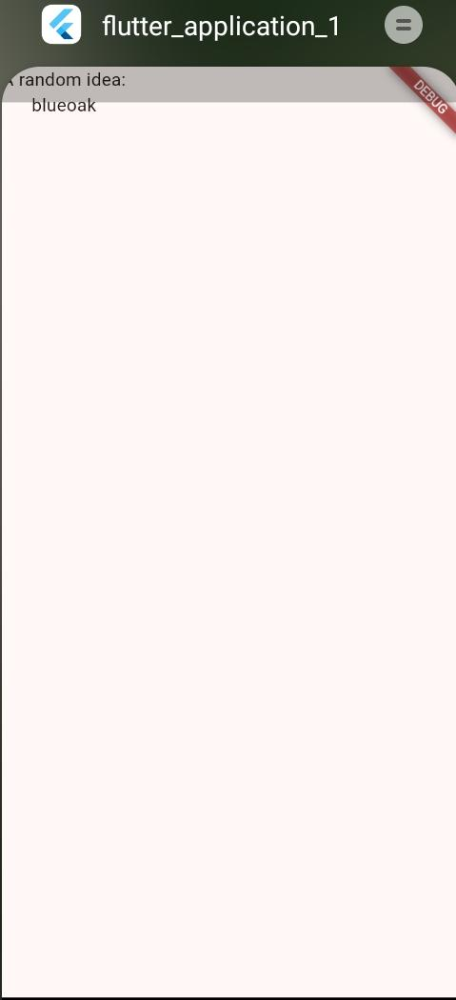

# TUGAS - Aplikasi Flutter pertama Anda

## Identitas Mahasiswa

| Atribut | Nilai                   |
| ------- | ----------------------- |
| Nama    | Nayla Annora Nobel W    |
| NIM     | 244107060148            |
| Kelas   | SIB-2E                  |

---

## Membuat Project

### Membuat proyek Flutter pertama Anda

Buka file pubspec.yaml. Ganti konten file ini dengan kode berikut:
```dart
name: namer_app
description: A new Flutter project.

publish_to: 'none' # Remove this line if you wish to publish to pub.dev

version: 0.0.1+1

environment:
  sdk: '>=2.19.4 <4.0.0'

dependencies:
  flutter:
    sdk: flutter

  english_words: ^4.0.0
  provider: ^6.0.0

dev_dependencies:
  flutter_test:
    sdk: flutter

  flutter_lints: ^2.0.0

flutter:
  uses-material-design: true
```

Berikutnya, buka file konfigurasi lainnya dalam proyek tersebut, analysis_options.yaml. Ganti konten file tersebut dengan kode berikut:
```dart
include: package:flutter_lints/flutter.yaml

linter:
  rules:
    prefer_const_constructors: false
    prefer_final_fields: false
    use_key_in_widget_constructors: false
    prefer_const_literals_to_create_immutables: false
    prefer_const_constructors_in_immutables: false
    avoid_print: false
```

Terakhir, buka file main.dart pada direktori lib/. Ganti konten file ini dengan kode berikut:
```dart
import 'package:english_words/english_words.dart';
import 'package:flutter/material.dart';
import 'package:provider/provider.dart';

void main() {
  runApp(MyApp());
}

class MyApp extends StatelessWidget {
  const MyApp({super.key});

  @override
  Widget build(BuildContext context) {
    return ChangeNotifierProvider(
      create: (context) => MyAppState(),
      child: MaterialApp(
        title: 'Namer App',
        theme: ThemeData(
          useMaterial3: true,
          colorScheme: ColorScheme.fromSeed(seedColor: Colors.deepOrange),
        ),
        home: MyHomePage(),
      ),
    );
  }
}

class MyAppState extends ChangeNotifier {
  var current = WordPair.random();
}

class MyHomePage extends StatelessWidget {
  @override
  Widget build(BuildContext context) {
    var appState = context.watch<MyAppState>();

    return Scaffold(
      body: Column(
        children: [
          Text('A random idea:'),
          Text(appState.current.asLowerCase),
        ],
      ),
    );
  }
}
```

## Membuat Tombol

### Meluncurkan aplikasi



### Hot Reload Pertama

Di bagian bawah lib/main.dart, tambahkan sesuatu pada string di objek Text pertama.
```dart
// ...

    return Scaffold(
      body: Column(
        children: [
          Text('A random AWESOME idea:'),  // ← Example change.
          Text(appState.current.asLowerCase),
        ],
      ),
    );

// ...
```

