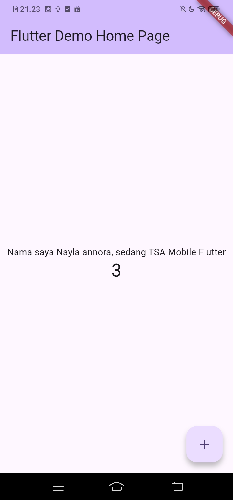
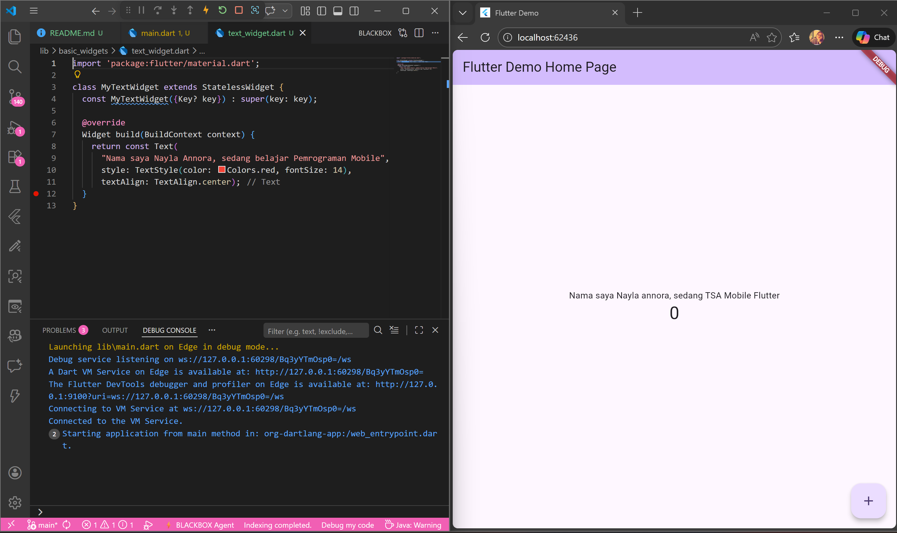
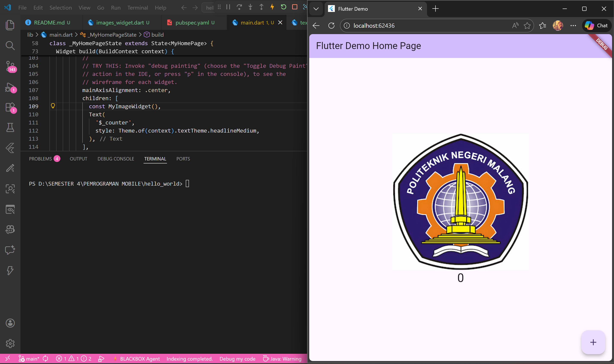

# Laporan Praktikum #05 - Aplikasi Pertama dan Widget Dasar Flutter

## Identitas Mahasiswa

| Atribut | Nilai                   |
| ------- | ----------------------- |
| Nama    | Nayla Annora Nobel W    |
| NIM     | 244107060148            |
| Kelas   | SIB-2E                  |

---
## Praktikum 3

Langkah 12

 

## Praktikum 4

### Langkah 1 
```dart
import 'package:flutter/material.dart';

class MyTextWidget extends StatelessWidget {
  const MyTextWidget({Key? key}) : super(key: key);

  @override
  Widget build(BuildContext context) {
    return const Text(
      "Nama saya Fulan, sedang belajar Pemrograman Mobile",
      style: TextStyle(color: Colors.red, fontSize: 14),
      textAlign: TextAlign.center);
  }
}
```

Lakukan import file text_widget.dart ke main.dart

```dart
import 'package:flutter/material.dart';
import 'basic_widgets/text_widget.dart';
```



### Langkah 2
```dart
import 'package:flutter/material.dart';

class MyImageWidget extends StatelessWidget {
  const MyImageWidget({Key? key}) : super(key: key);

  @override
  Widget build(BuildContext context) {
    return const Image(
      image: AssetImage("logo_polinema.jpg")
    );
  }
}
```

import di file main.dart 

```dart
import 'package:flutter/material.dart';
import 'basic_widgets/text_widget.dart';
import 'basic_widgets/images_widget.dart';
```



## Praktikum 5

### Langkah 1
```dart
return MaterialApp(
      home: Container(
        margin: const EdgeInsets.only(top: 30),
        color: Colors.white,
        child: Column(
          children: <Widget>[
            CupertinoButton(
              child: const Text("Contoh button"),
              onPressed: () {},
            ),
            const CupertinoActivityIndicator(),
          ],
        ),
      ),
    );
```


