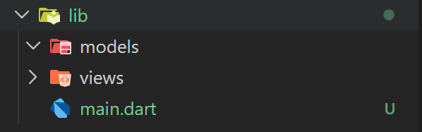
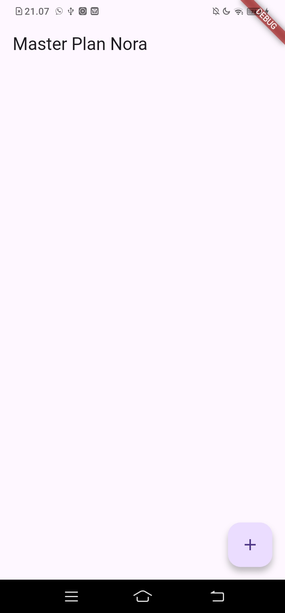
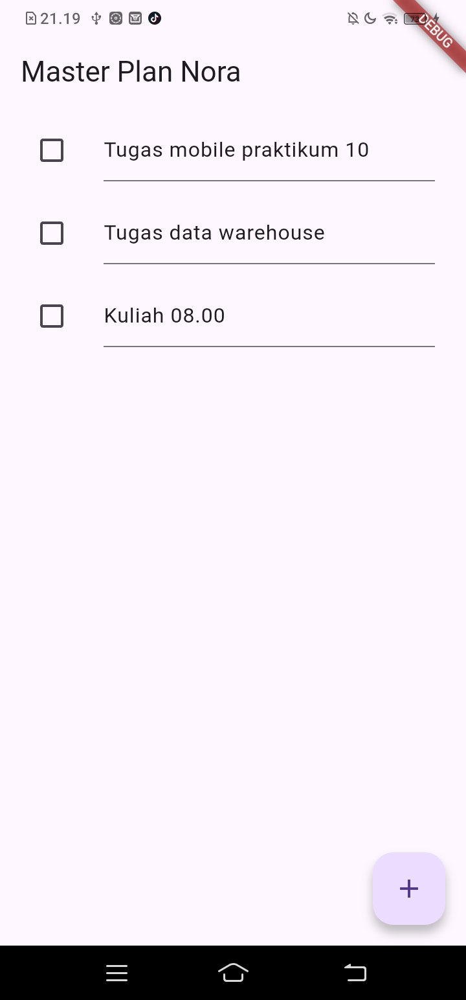

# Laporan Praktikum #10 - Dasar State dengan Model-View

## Identitas Mahasiswa

| Atribut | Nilai                   |
| ------- | ----------------------- |
| Nama    | Nayla Annora Nobel W    |
| NIM     | 244107060148            |
| Kelas   | SIB-2E                  |

---

## Praktikum 1: Dasar State dengan Model-View

### Langkah 1: Buat Project Baru

Buatlah sebuah project flutter baru dengan nama master_plan di folder src week-10 repository GitHub Anda atau sesuai style laporan praktikum yang telah disepakati. Lalu buatlah susunan folder dalam project seperti gambar berikut ini.



### Langkah 2: Membuat model task.dart

Di folder model, buat file bernama task.dart dan buat class Task. Class ini memiliki atribut description dengan tipe data String dan complete dengan tipe data Boolean, serta ada konstruktor. Kelas ini akan menyimpan data tugas untuk aplikasi kita. Tambahkan kode berikut:
```dart
class Task {
  final String description;
  final bool complete;
  
  const Task({
    this.complete = false,
    this.description = '',
  });
}
```

### Langkah 3: Buat file plan.dart

Buat file plan.dart di dalam folder models dan isi kode seperti berikut.
```dart
import './task.dart';

class Plan {
  final String name;
  final List<Task> tasks;
  
  const Plan({this.name = '', this.tasks = const []});
}
```

### Langkah 4: Buat file data_layer.dart

Buat file bernama data_layer.dart di folder models. Kodenya hanya berisi export seperti berikut.

```dart
export 'plan.dart';
export 'task.dart';
```

### Langkah 5: Pindah ke file main.dart

Ubah isi kode main.dart sebagai berikut.
```dart
import 'package:flutter/material.dart';
import './views/plan_screen.dart';

void main() => runApp(MasterPlanApp());

class MasterPlanApp extends StatelessWidget {
  const MasterPlanApp({super.key});

  @override
  Widget build(BuildContext context) {
    return MaterialApp(
     theme: ThemeData(primarySwatch: Colors.purple),
     home: PlanScreen(),
    );
  }
}
```

### Langkah 6: buat plan_screen.dart

Pada folder views, buatlah sebuah file plan_screen.dart dan gunakan templat StatefulWidget untuk membuat class PlanScreen. Isi kodenya adalah sebagai berikut. Gantilah teks ‘Namaku' dengan nama panggilan Anda pada title AppBar.
```dart
import '../models/data_layer.dart';
import 'package:flutter/material.dart';

class PlanScreen extends StatefulWidget {
  const PlanScreen({super.key});

  @override
  State createState() => _PlanScreenState();
}

class _PlanScreenState extends State<PlanScreen> {
  Plan plan = const Plan();

  @override
  Widget build(BuildContext context) {
   return Scaffold(
    // ganti ‘Namaku' dengan Nama panggilan Anda
    appBar: AppBar(title: const Text('Master Plan Nora')),
    body: _buildList(),
    floatingActionButton: _buildAddTaskButton(),
   );
  }
}
```

### Langkah 7: buat method _buildAddTaskButton()

Tambah kode berikut di bawah method build di dalam class _PlanScreenState.
```dart
Widget _buildAddTaskButton() {
  return FloatingActionButton(
   child: const Icon(Icons.add),
   onPressed: () {
     setState(() {
      plan = Plan(
       name: plan.name,
       tasks: List<Task>.from(plan.tasks)
       ..add(const Task()),
     );
    });
   },
  );
}
```

### Langkah 8: buat widget _buildList()

Buat widget ListView seperti kode berikut ini.
```dart
Widget _buildList() {
  return ListView.builder(
   itemCount: plan.tasks.length,
   itemBuilder: (context, index) =>
   _buildTaskTile(plan.tasks[index], index),
  );
}
```

### Langkah 9: buat widget _buildTaskTile

Kita buat dinamis untuk setiap index data, sehingga membuat view menjadi lebih mudah. Tambahkan kode berikut ini.

```dart
Widget _buildTaskTile(Task task, int index) {
    return ListTile(
      leading: Checkbox(
          value: task.complete,
          onChanged: (selected) {
            setState(() {
              plan = Plan(
                name: plan.name,
                tasks: List<Task>.from(plan.tasks)
                  ..[index] = Task(
                    description: task.description,
                    complete: selected ?? false,
                  ),
              );
            });
          }),
      title: TextFormField(
        initialValue: task.description,
        onChanged: (text) {
          setState(() {
            plan = Plan(
              name: plan.name,
              tasks: List<Task>.from(plan.tasks)
                ..[index] = Task(
                  description: text,
                  complete: task.complete,
                ),
            );
          });
        },
      ),
    );
  }
```

Run atau tekan F5 untuk melihat hasil aplikasi yang Anda telah buat. Capture hasilnya untuk soal praktikum nomor 4.



### Langkah 10: Tambah Scroll Controller

Anda dapat menambah tugas sebanyak-banyaknya, menandainya jika sudah beres, dan melakukan scroll jika sudah semakin banyak isinya. Namun, ada salah satu fitur tertentu di iOS perlu kita tambahkan. Ketika keyboard tampil, Anda akan kesulitan untuk mengisi yang paling bawah. Untuk mengatasi itu, Anda dapat menggunakan ScrollController untuk menghapus focus dari semua TextField selama event scroll dilakukan. Pada file plan_screen.dart, tambahkan variabel scroll controller di class State tepat setelah variabel plan.

```dart
late ScrollController scrollController;
```

### Langkah 11: Tambah Scroll Listener

Tambahkan method initState() setelah deklarasi variabel scrollController seperti kode berikut.

```dart
@override
void initState() {
  super.initState();
  scrollController = ScrollController()
    ..addListener(() {
      FocusScope.of(context).requestFocus(FocusNode());
    });
}
```

### Langkah 12: Tambah controller dan keyboard behavior

Tambahkan controller dan keyboard behavior pada ListView di method _buildList seperti kode berikut ini.
```dart
return ListView.builder(
  controller: scrollController,
 keyboardDismissBehavior: Theme.of(context).platform ==
 TargetPlatform.iOS
          ? ScrollViewKeyboardDismissBehavior.onDrag
          : ScrollViewKeyboardDismissBehavior.manual,
)
```

### Langkah 13: Terakhir, tambah method dispose()

Terakhir, tambahkan method dispose() berguna ketika widget sudah tidak digunakan lagi.

```dart
@override
void dispose() {
  scrollController.dispose();
  super.dispose();
}
```

Langkah 14: Hasil



Lakukan Hot restart (bukan hot reload) pada aplikasi Flutter Anda. Anda akan melihat tampilan akhir seperti gambar berikut. Jika masih terdapat error, silakan diperbaiki hingga bisa running.

### Tugas Praktikum 1: Dasar State dengan Model-View

1. Jelaskan maksud dari langkah 4 pada praktikum tersebut! Mengapa dilakukan demikian?

Jawaban:

Langkah ini menginstruksikan pembuatan file data_layer.dart di dalam folder models. File ini tidak berisi logika pemrograman (seperti class atau fungsi), melainkan hanya berisi pernyataan export. Dengan mengekspor plan.dart dan task.dart, file ini secara efektif "membungkus" kedua model tersebut sehingga dapat diakses melalui satu pintu.

2. Mengapa perlu variabel plan di langkah 6 pada praktikum tersebut? Mengapa dibuat konstanta ?

Jawaban :

Variabel plan diperlukan sebagai penampung data utama yang akan ditampilkan dan dikelola pada layar PlanScreen. Penggunaan const pada saat inisialisasi Plan plan = const Plan(); memiliki tujuan teknis dalam optimasi Flutter

3. Lakukan capture hasil dari Langkah 9 berupa GIF, kemudian jelaskan apa yang telah Anda buat!


4. Apa kegunaan method pada Langkah 11 dan 13 dalam lifecyle state ?

Jawaban :

Pasangan metode yang sangat penting untuk mengelola sumber daya (resources) aplikasi. initState() : tahap pertama dalam lifecycle setelah objek State dibuat dan dispose() : tahap terakhir dalam lifecycle sebelum objek State dihapus secara permanen dari memori.
