# Laporan Praktikum #03 - Pemrograman Dasar Dart - Bag.2

## Identitas Mahasiswa

| Atribut | Nilai                   |
| ------- | ----------------------- |
| Nama    | Nayla Annora Nobel W    |
| NIM     | 244107060148            |
| Kelas   | SIB-2E                  |

---
## Praktikum 1

### Langkah 1
```dart
String test = "test2";
if (test == "test1") {
   print("Test1");
} else If (test == "test2") {
   print("Test2");
} Else {
   print("Something else");
}

if (test == "test2") print("Test2 again");
```

### Langkah 2

Silakan coba eksekusi (Run) kode pada langkah 1 tersebut. Apa yang terjadi? Jelaskan!

**Jawaban:**

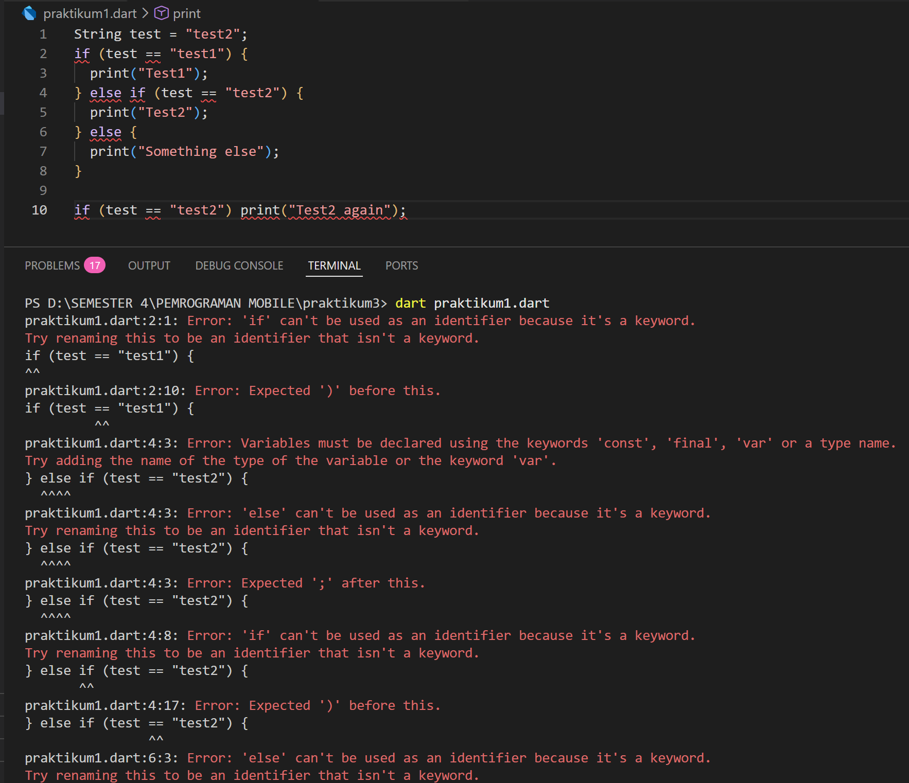

Pada program tidak boleh langsung berisi perintah if, print, dll di luar fungsi (kecuali variabel global tertentu). Semua eksekusi harus dimulai dari main().

```dart
void main() {
  String test = "test2";

  if (test == "test1") {
    print("Test1");
  } else if (test == "test2") {
    print("Test2");
  } else {
    print("Something else");
  }

  if (test == "test2") print("Test2 again");
}
```
Output setelah diperbaiki:

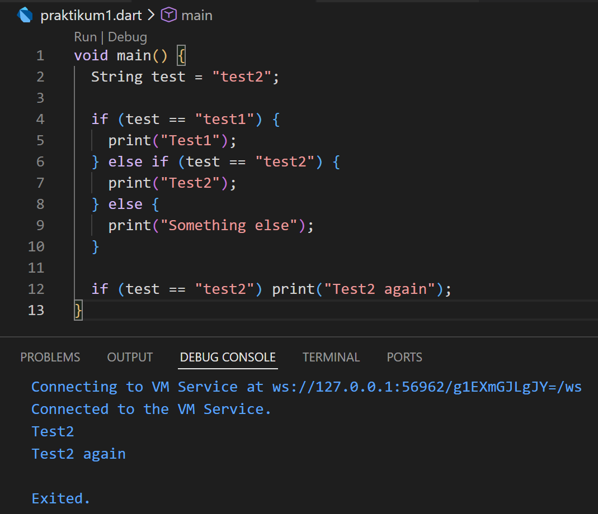

### Langkah 3

Tambahkan kode program berikut, lalu coba eksekusi (Run) kode Anda.

```dart
String test = "true";
if (test) {
   print("Kebenaran");
}
```

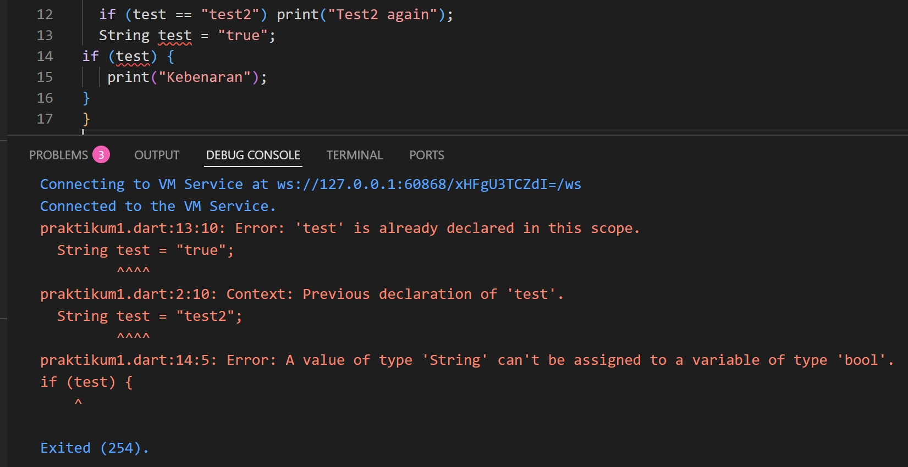

Kode di atas mengalami **2 error**. Pertama, variabel `test` dideklarasikan dua kali dalam satu scope (di dalam fungsi atau blok yang sama). Di baris awal kita sudah menulis `String test = "test2";`, lalu di baris 13 kita menulis lagi `String test = "true";`. Dart tidak mengizinkan dua variabel dengan nama yang sama dalam satu ruang lingkup, sehingga muncul error _test is already declared in this scope_.

Kedua, menggunakan `if (test)` padahal `test` bertipe `String`. Pada Dart, kondisi di dalam `if` harus bertipe `bool`, bukan `String`. Karena itu muncul _error A value of type 'String' can't be assigned to a variable of type 'bool'_. Jika ingin mengecek isi `string`, seharusnya ditulis seperti `if (test == "true")` atau gunakan variabel bertipe `bool` misalnya `bool test = true;`.

Berikut kode yang sudah diperbaiki agar tetap menggunakan `if/else`:

Output setelah diperbaiki:

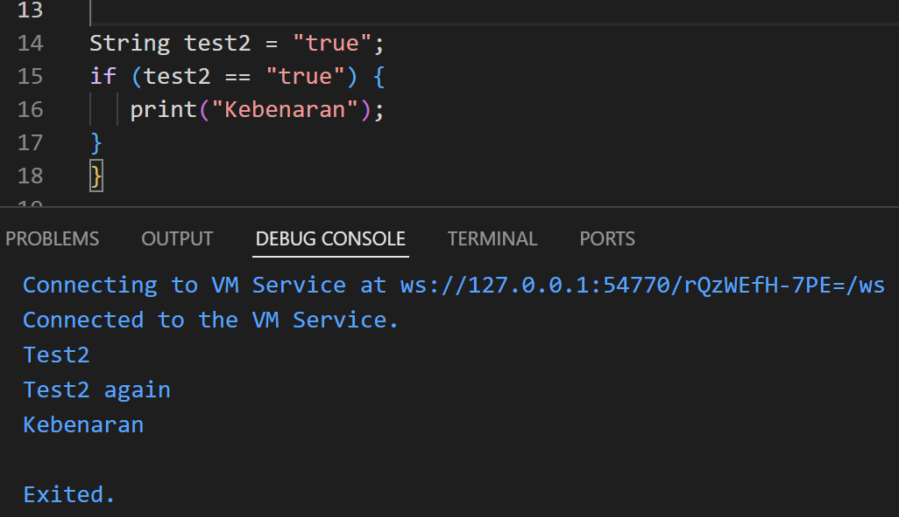

---

## Praktikum 2

### Langkah 1
```dart
while (counter < 33) {
  print(counter);
  counter++;
}
```
### Langkah 2

Silakan coba eksekusi (Run) kode pada langkah 1 tersebut. Apa yang terjadi? Jelaskan!

**Jawaban:**

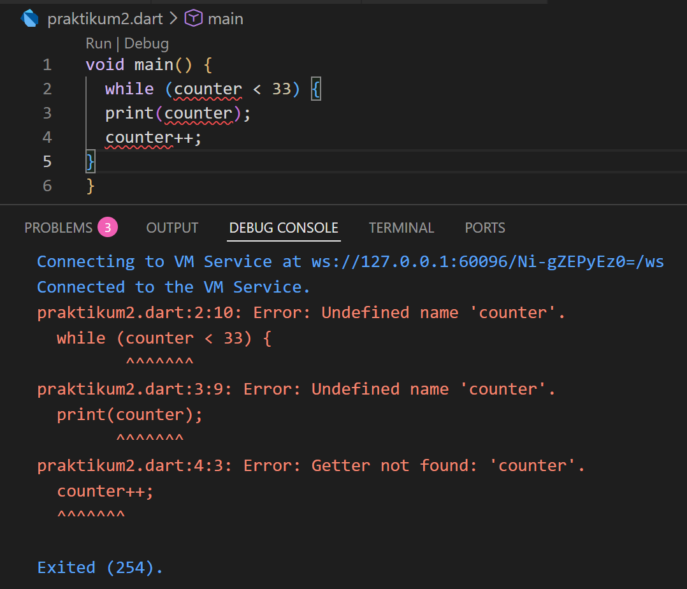

Program mengalami error karena variabel counter belum dideklarasikan, tetapi sudah langsung digunakan di dalam while. Berikut perbaikannya :

```dart
void main() {
  int counter = 0;
  while (counter < 33) {
  print(counter);
  counter++;
}
}
```

Output setelah diperbaiki :

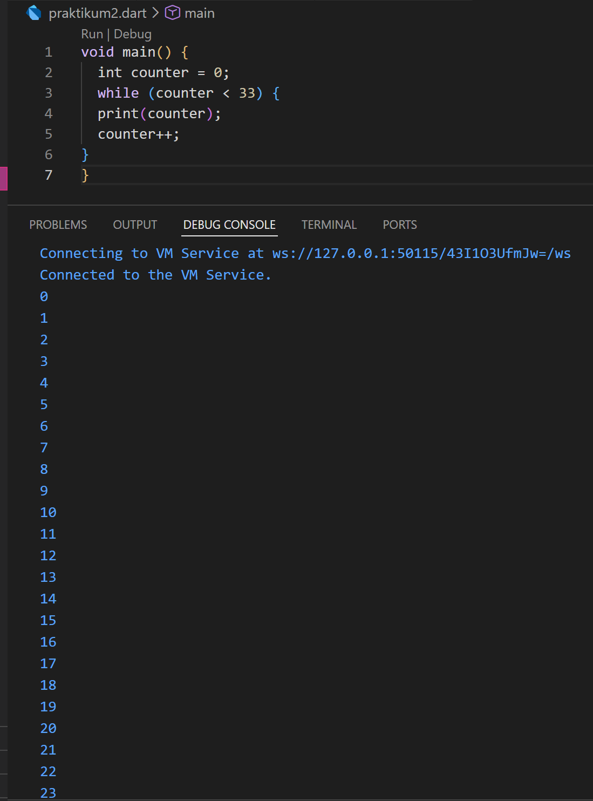

### Langkah 3

Tambahkan kode program berikut, lalu coba eksekusi (Run) kode Anda.

```dart
do {
  print(counter);
  counter++;
} while (counter < 77);
```

Apa yang terjadi ? Jika terjadi error, silakan perbaiki namun tetap menggunakan do-while.

**Jawaban:**

Jika kode do-while langsung ditambahkan seperti pada soal, biasanya program akan error atau hasilnya tidak sesuai.

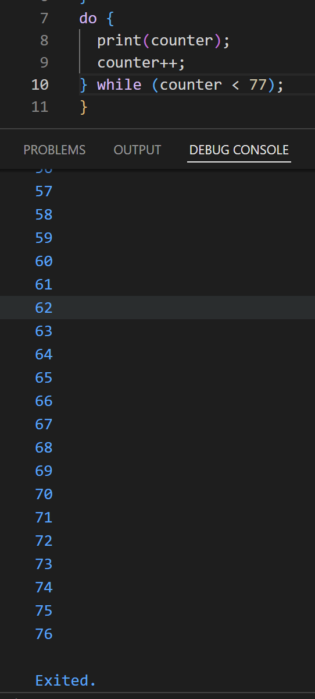

## Praktikum 3

### Langkah 1

Ketik atau salin kode program berikut ke dalam fungsi main().

```dart
for (Index = 10; index < 27; index) {
  print(Index);
}
```

### Langkah 2

Silakan coba eksekusi (Run) kode pada langkah 1 tersebut. Apa yang terjadi? Jelaskan!

**Jawaban:**

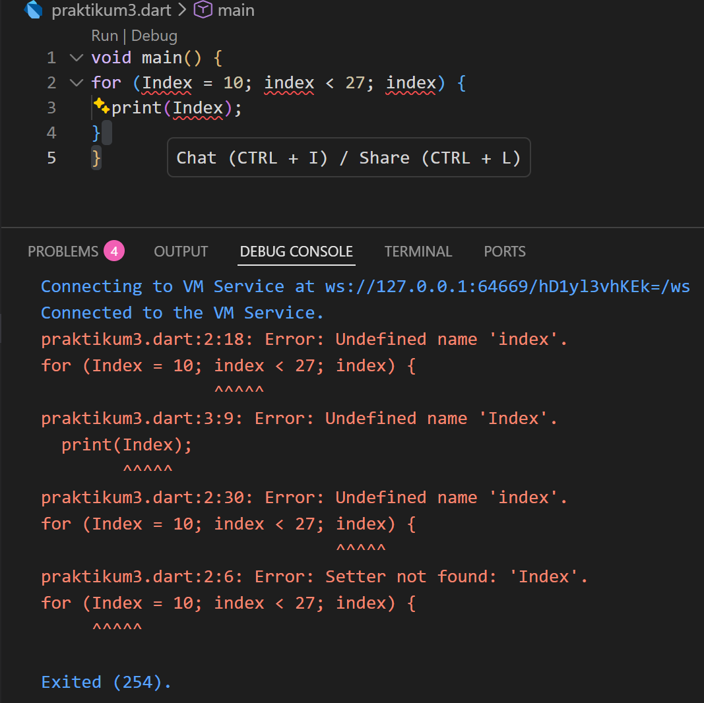

Terdapat 3 kesalahan :

1. Variabel Index belum dideklarasikan
2. Huruf besar & kecil berbeda 
3. Increment salah (index)

Dibawah ini adalah code perbaikannya!

```dart
void main() {
  for (int index = 10; index < 27; index++) {
    print(index);
  }
}
```
Output setelah diperbaiki:

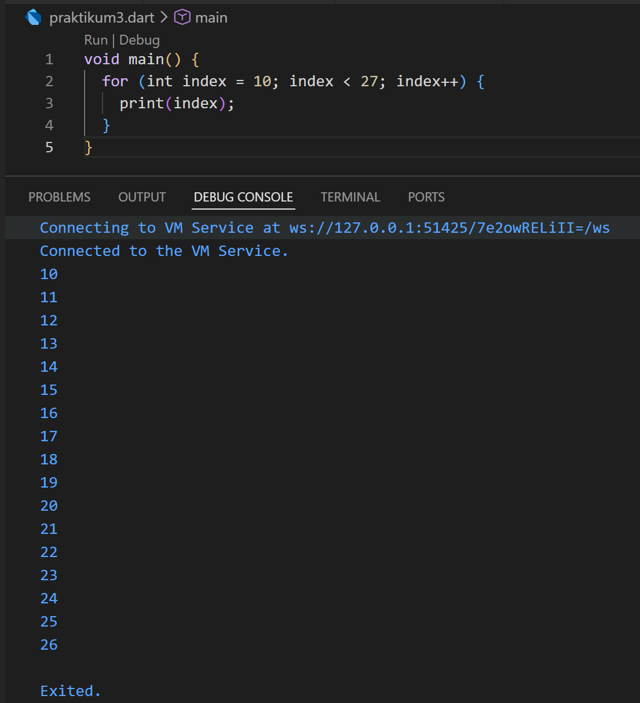 

### Langkah 3

Tambahkan kode program berikut di dalam _for-loop_, lalu coba eksekusi (Run) kode Anda.

```dart
If (Index == 21) break;
Else If (index > 1 || index < 7) continue;
print(index);
```

**Jawaban:**

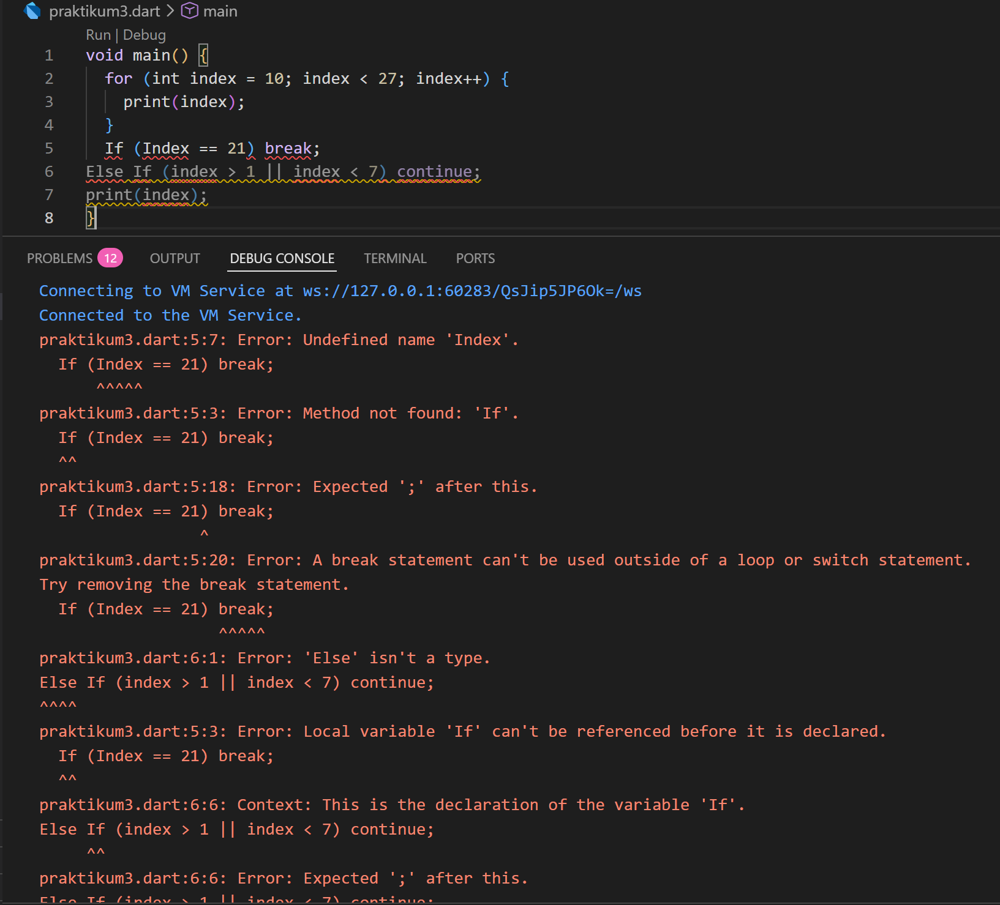

Alasan error?

Error terjadi karena penulisan sintaksnya salah:
1. If harus huruf kecil → if
2. Else If harus ditulis → else if
3. Index dan index berbeda (case sensitive)
4. Kondisi index > 1 || index < 7 akan selalu bernilai true, sehingga continue terus berjalan.
5. Biasanya kode ini berada di dalam for-loop.

Berikut kode yang sudah diperbaiki:

```dart
void main() {
  for (int index = 10; index < 27; index++) {
    
    if (index == 21) break;
    else if (index > 1 && index < 7) continue;

    print(index);
  }
}
```

Output setelah diperbaiki:

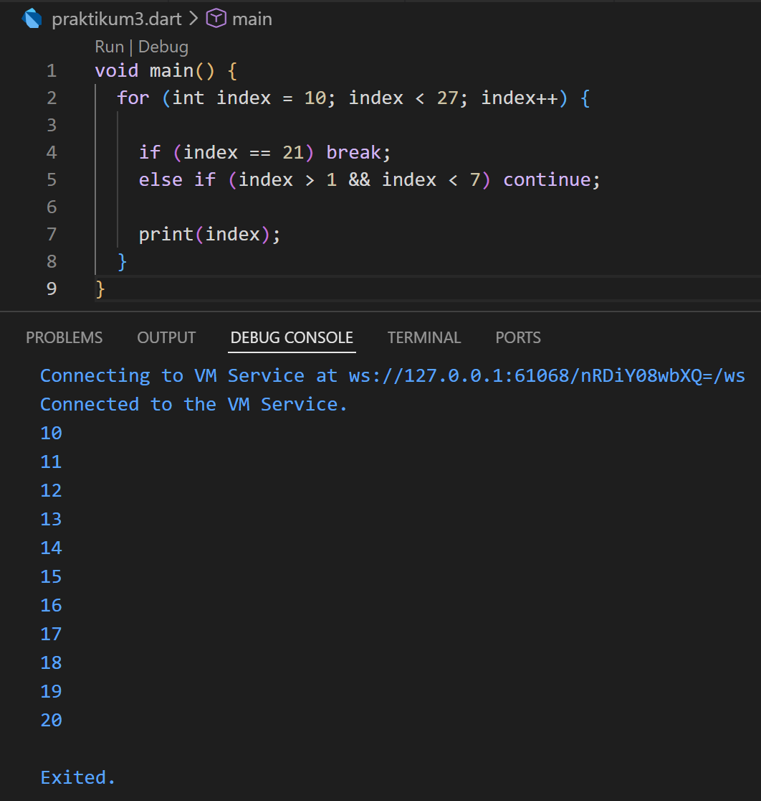

## Tugas Praktikum 

Buatlah sebuah program yang dapat menampilkan bilangan prima dari angka 0 sampai 201 menggunakan Dart. Ketika bilangan prima ditemukan, maka tampilkan nama lengkap dan NIM Anda.

```dart
void main() {
  String nama = "Nayla Annora Nobel Widyonarko";
  String nim = "244107060148";

  for (int i = 0; i <= 201; i++) {
    bool isPrima = true;

    if (i < 2) {
      isPrima = false;
    } else {
      for (int j = 2; j <= i ~/ 2; j++) {
        if (i % j == 0) {
          isPrima = false;
          break;
        }
      }
    }

    if (isPrima) {
      print("$i adalah bilangan prima");
      print("Nama: $nama");
      print("NIM: $nim");
      print("-----------------------");
    }
  }
}
```

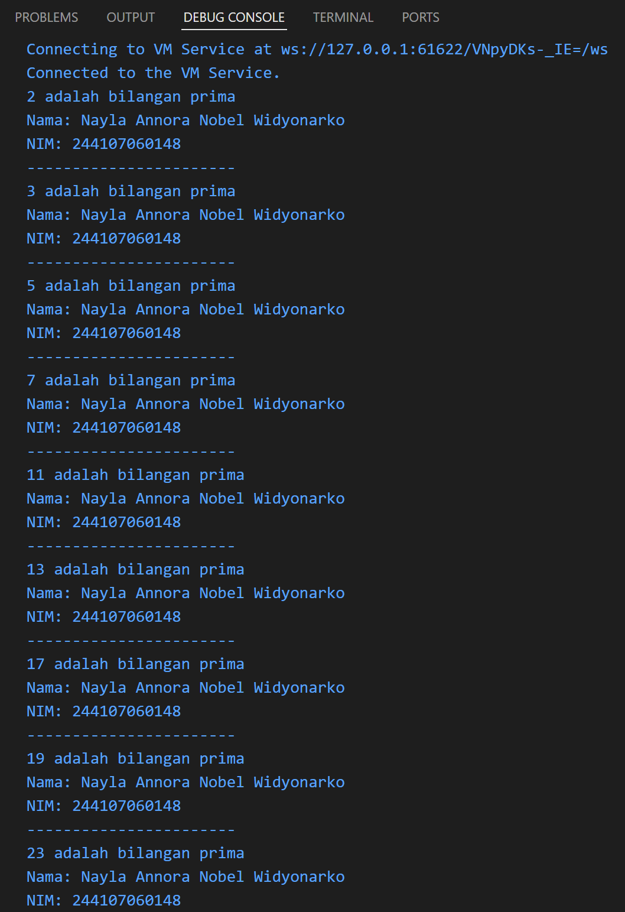