# Laporan Praktikum #04 - pengantar Bahasa Pemrograman Dart - Bag. 3

## Identitas Mahasiswa

| Atribut | Nilai                   |
| ------- | ----------------------- |
| Nama    | Nayla Annora Nobel W    |
| NIM     | 244107060148            |
| Kelas   | SIB-2E                  |

---
## Praktikum 1

### Langkah 1
```dart
void main() {
var list = [1, 2, 3];
assert(list.length == 3);
assert(list[1] == 2);
print(list.length);
print(list[1]);

list[1] = 1;
assert(list[1] == 1);
print(list[1]);
}
```

### Langkah 2

Silakan coba eksekusi (Run) kode pada langkah 1 tersebut. Apa yang terjadi? Jelaskan!

**Jawaban:**

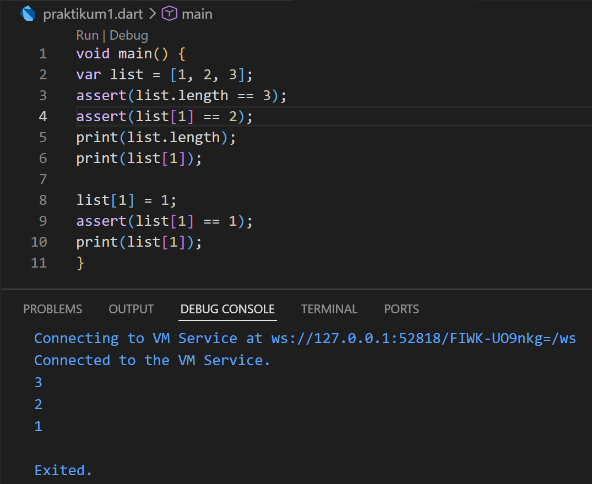

Pada kode ini menunjukkan penggunaan asser untuk mengecek kondisi serta membuat list di Dart, mengakses elemen dengan menggunakan index dan mengubah nilai elemen dengan index

### Langkah 3

Ubah kode pada langkah 1 menjadi variabel final yang mempunyai index = 5 dengan default value = null. Isilah nama dan NIM Anda pada elemen index ke-1 dan ke-2. Lalu print dan capture hasilnya.

Apa yang terjadi ? Jika terjadi error, silakan perbaiki.

**Jawaban:**

```dart
void main() {
  final List<String?> list = List.filled(5, null);

  list[1] = "Nayla Annora Nobel Widyonarko";
  list[2] = "244107060148";

  print(list.length);
  print(list);
  print(list[1]);
  print(list[2]);
}
```

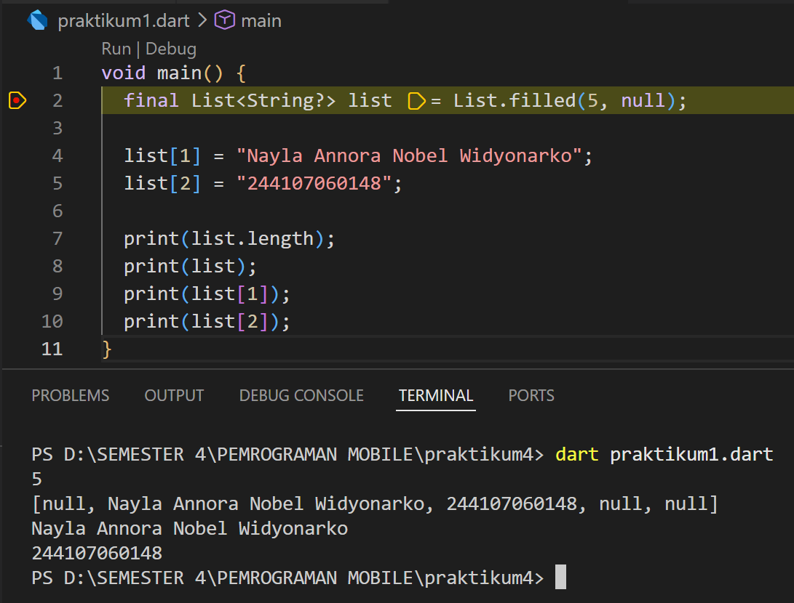

## Praktikum 2

### Langkah 1
```dart
void main() {
var halogens = {'fluorine', 'chlorine', 'bromine', 'iodine', 'astatine'};
print(halogens);
}
```

### Langkah 2

Silakan coba eksekusi (Run) kode pada langkah 1 tersebut. Apa yang terjadi? Jelaskan! Lalu perbaiki jika terjadi error.

**Jawaban:**

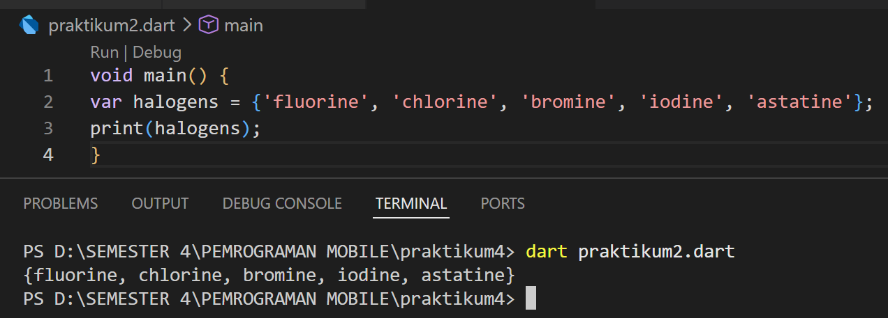

Membuat sebuah Set bernama halogens yang berisi lima unsur kimia golongan halogen, lalu menampilkan seluruh isi Set tersebut ke terminal menggunakan print()

### Langkah 3

Tambahkan kode program berikut, lalu coba eksekusi (Run) kode Anda. 

```dart
var names1 = <String>{};
Set<String> names2 = {}; 
var names3 = {}; 

print(names1);
print(names2);
print(names3);
```

Apa yang terjadi ? Jika terjadi error, silakan perbaiki namun tetap menggunakan ketiga variabel tersebut. Tambahkan elemen nama dan NIM Anda pada kedua variabel Set tersebut dengan dua fungsi berbeda yaitu .add() dan .addAll(). Untuk variabel Map dihapus, nanti kita coba di praktikum selanjutnya.

**Jawaban:**

Program membuat beberapa set kosong dan menampilkannya.

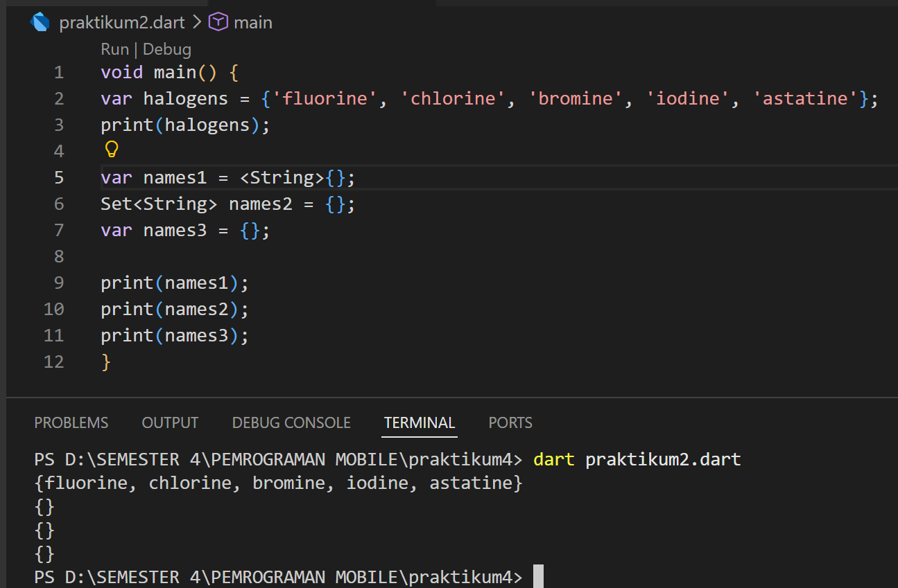

Penambahan nama dan NIM 

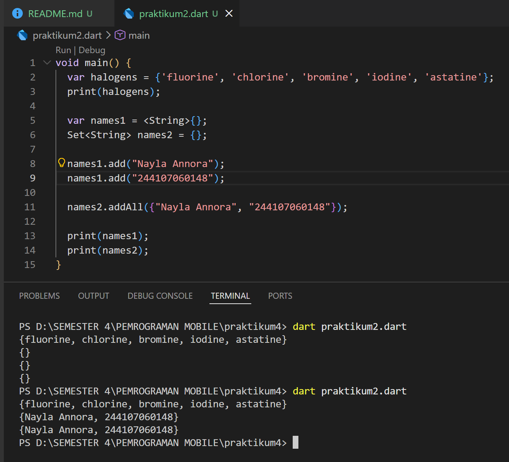

## Praktikum 3

### Langkah 1
```dart
var gifts = {
  'first': 'partridge',
  'second': 'turtledoves',
  'fifth': 1
};

var nobleGases = {
  2: 'helium',
  10: 'neon',
  18: 2,
};

print(gifts);
print(nobleGases);
```

### Langkah 2

Silakan coba eksekusi (Run) kode pada langkah 1 tersebut. Apa yang terjadi? Jelaskan! Lalu perbaiki jika terjadi error.

**Jawaban:**

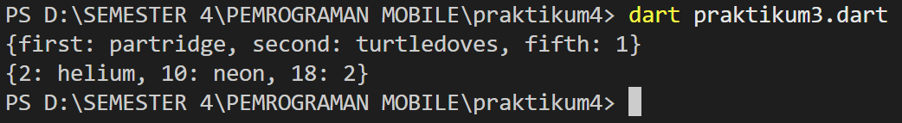

Pada kode ini penggunaan Map di Dart, yaitu struktur data yang menyimpan pasangan key-value. Map gifts menggunakan key bertipe String, sedangkan nobleGases menggunakan key bertipe integer.

### Langkah 3

Tambahkan kode program berikut, lalu coba eksekusi (Run) kode Anda.
```dart
var mhs1 = Map<String, String>();
gifts['first'] = 'partridge';
gifts['second'] = 'turtledoves';
gifts['fifth'] = 'golden rings';

var mhs2 = Map<int, String>();
nobleGases[2] = 'helium';
nobleGases[10] = 'neon';
nobleGases[18] = 'argon';
```

Apa yang terjadi ? Jika terjadi error, silakan perbaiki. Tambahkan elemen nama dan NIM Anda pada tiap variabel di atas (gifts, nobleGases, mhs1, dan mhs2). 

**Jawaban:**

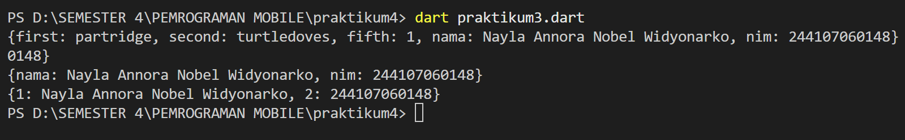

## Praktikum 4

### Langkah 1

Ketik atau salin kode program berikut ke dalam fungsi main().
```dart
var list = [1, 2, 3];
var list2 = [0, ...list];
print(list1);
print(list2);
print(list2.length);
```

### Langkah 2

Silakan coba eksekusi (Run) kode pada langkah 1 tersebut. Apa yang terjadi? Jelaskan! Lalu perbaiki jika terjadi error.

**Jawaban:**

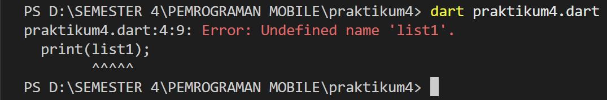

Yang terjadi : 
1. var list = [1,2,3]; → membuat List berisi angka 1, 2, 3
2. var list2 = [0, ...list]; → menggunakan spread operator (...) untuk memasukkan semua isi list ke dalam list2
3. print(list); → menampilkan list pertama
4. print(list2); → menampilkan list kedua
5. print(list2.length); → menampilkan jumlah elemen dalam list2

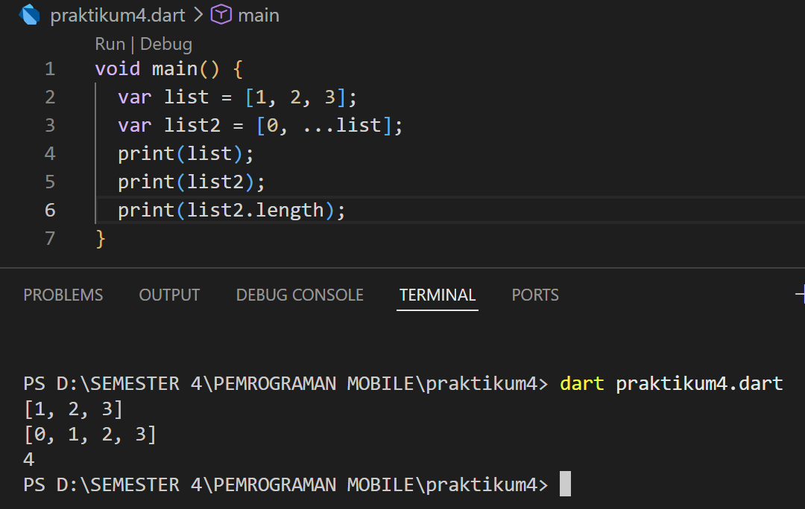

### Langkah 3

Tambahkan kode program berikut, lalu coba eksekusi (Run) kode Anda.

```dart
list1 = [1, 2, null];
print(list1);
var list3 = [0, ...?list1];
print(list3.length);
```

**Jawaban:**

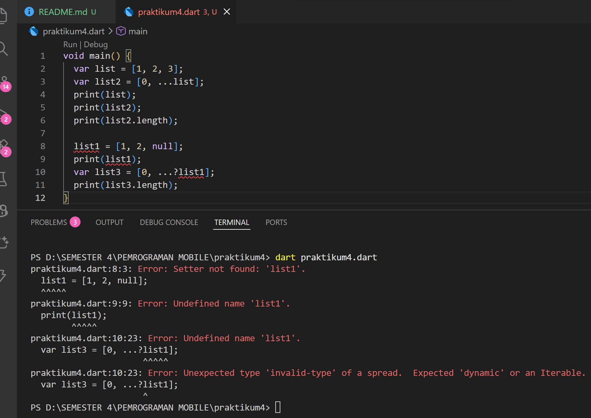

Apa yang terjadi ? Jika terjadi error, silakan perbaiki.

Yang terjadi :
1. var list = [1,2,3]; Membuat list berisi angka 1, 2, 3.
2. var list2 = [0, ...list]; Menggunakan Spread Operator (...) untuk memasukkan isi list ke dalam list2.
3. print(list2.length); Panjang list2 adalah 4.
4. list1 = [1,2,null]; Error karena list1 tidak dideklarasikan.
5. ...?list1 Ini adalah Null-aware spread operator, yang artinya jika list1 null maka tidak dimasukkan ke list.

Tambahkan variabel list berisi NIM Anda menggunakan Spread Operators.

```dart
void main() {
  var list = [1, 2, 3];
  var list2 = [0, ...list];

  print(list);
  print(list2);
  print(list2.length);

  List<int?> list1 = [1, 2, null];
  print(list1);

  var list3 = [0, ...?list1];
  print(list3);
  print(list3.length);

  var nim = [244107060148];
  var listNim = [...nim];

  print(listNim);
}
```

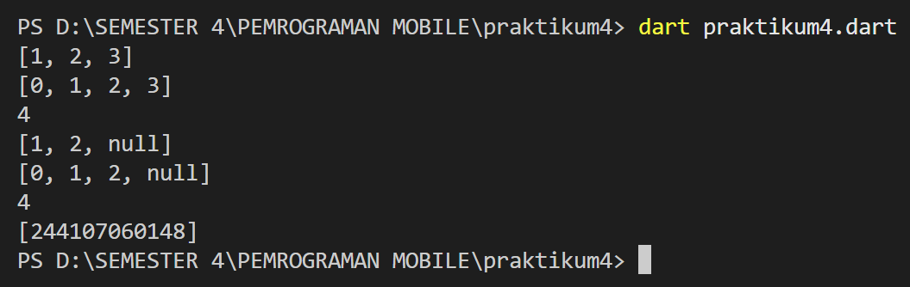

### Langkah 4

Tambahkan kode program berikut, lalu coba eksekusi (Run) kode Anda.
```dart
var nav = ['Home', 'Furniture', 'Plants', if (promoActive) 'Outlet'];
print(nav);
```

**Jawaban:**

Apa yang terjadi ? Jika terjadi error, silakan perbaiki. Tunjukkan hasilnya jika variabel promoActive ketika true dan false.

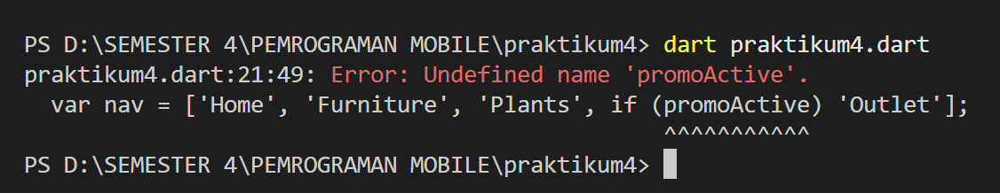

Kode di atas menggunakan fitur collection If pada list Dart, terjadi error karena promoActive belum dideklarasikan sebelumnya.

Perbaikan : 

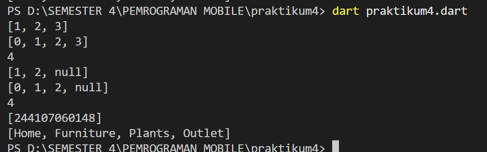

### Langkah 5

Tambahkan kode program berikut, lalu coba eksekusi (Run) kode Anda.

```dart
var nav2 = ['Home', 'Furniture', 'Plants', if (login case 'Manager') 'Inventory'];
print(nav2);
```

Apa yang terjadi ? Jika terjadi error, silakan perbaiki. Tunjukkan hasilnya jika variabel login mempunyai kondisi lain.

**Jawaban:**

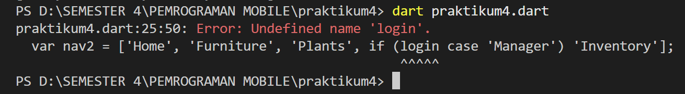

Sintaks if (login case 'Manager') adalah fitur pattern matching di Dart yang digunakan untuk mengecek apakah nilai variabel login sama dengan 'Manager', namun terjadi error karena variabel login  belum dideklarasikan sebelumnya.

Perbaikan:

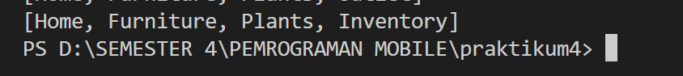

### Langkah 6

Tambahkan kode program berikut, lalu coba eksekusi (Run) kode Anda.
```dart
var listOfInts = [1, 2, 3];
var listOfStrings = ['#0', for (var i in listOfInts) '#$i'];
assert(listOfStrings[1] == '#1');
print(listOfStrings);
```

Apa yang terjadi ? Jika terjadi error, silakan perbaiki. Jelaskan manfaat Collection For dan dokumentasikan hasilnya.

**Jawaban:**

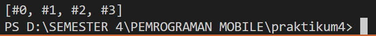

Manfaat collection For :
1. Membuat kode lebih singkat dan rapi
2. Mempermudah pembuatan data dari perulangan
3. Mengurangi panggunaan variabel tambahan

## Praktikum 5

### Langkah 1

Ketik atau salin kode program berikut ke dalam fungsi main().
```dart
var record = ('first', a: 2, b: true, 'last');
print(record)
```

### Langkah 2

Silakan coba eksekusi (Run) kode pada langkah 1 tersebut. Apa yang terjadi? Jelaskan! Lalu perbaiki jika terjadi error.

**Jawaban:**

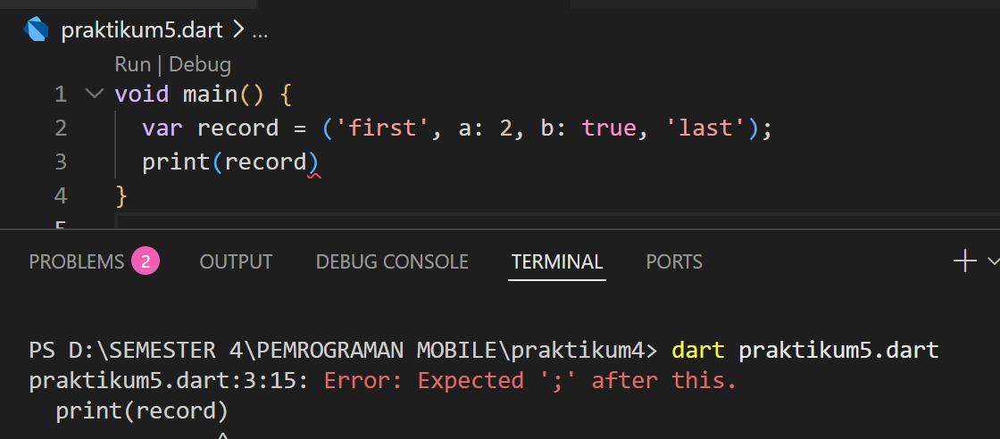

Kode ini mengalami error saat kompilasi karena ada semicolon (;) yang hilang di baris print(record). Setelah ditambahkan, kode berjalan normal. Kode tersebut membuat sebuah record, yaitu tipe data di dart yang dapat menyimpan beberaoa nilai dalma satu variabel.

Perbaikan :

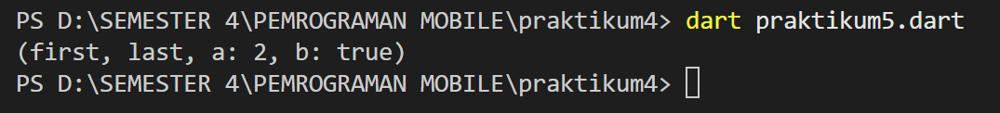

### Langkah 3

Tambahkan kode program berikut di luar scope void main(), lalu coba eksekusi (Run) kode Anda.
```dart
(int, int) tukar((int, int) record) {
  var (a, b) = record;
  return (b, a);
}
```

Apa yang terjadi ? Jika terjadi error, silakan perbaiki. Gunakan fungsi tukar() di dalam main() sehingga tampak jelas proses pertukaran value field di dalam Records.

**Jawaban:**

Kode di atas berjalan tanpa error, karena nilai yang dikembalikan sesuai dengan tipe fungsi (int, int)

```dart
(int, int) tukar((int, int) record) {
  var (a, b) = record;
  return (b, a);
}

void main() {
  var data = (10, 20);
  print("Data awal: $data");

  var hasil = tukar(data);
  print("Data setelah ditukar: $hasil");
}
```

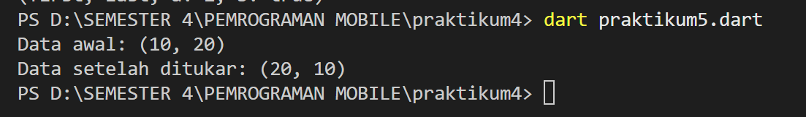

### Langkah 4

Tambahkan kode program berikut di dalam scope void main(), lalu coba eksekusi (Run) kode Anda.

```dart
(String, int) mahasiswa;
print(mahasiswa);
```

Apa yang terjadi ? Jika terjadi error, silakan perbaiki. Inisialisasi field nama dan NIM Anda pada variabel record mahasiswa di atas. Dokumentasikan hasilnya dan buat laporannya!

**Jawaban:**

Kode di atas error karena variabel mahasiswa dideklarasikan tetapi belum diinisialisasi

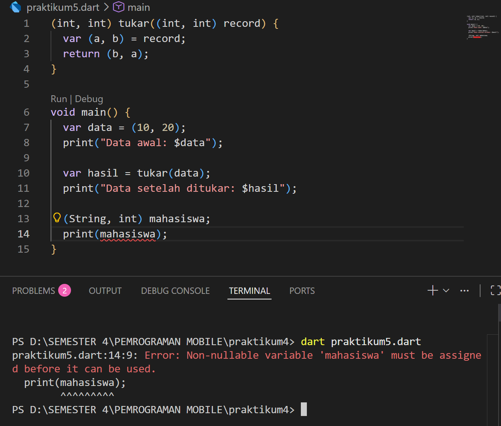

Setelah ditambahkan inisialisasi dengan nama dan NIM:
```dart
(int, int) tukar((int, int) record) {
  var (a, b) = record;
  return (b, a);
}

void main() {
  var data = (10, 20);
  print("Data awal: $data");

  var hasil = tukar(data);
  print("Data setelah ditukar: $hasil");

  (String, int) mahasiswa;
  mahasiswa = ('Nayla annora nobel widyonarko', 244107060148);
  print(mahasiswa);
}
```

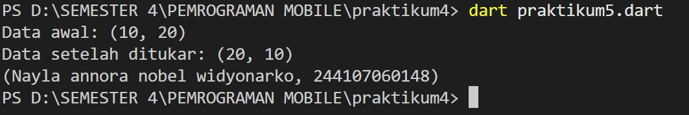

### Langkah 5

Tambahkan kode program berikut di dalam scope void main(), lalu coba eksekusi (Run) kode Anda.
```dart
var mahasiswa2 = ('first', a: 2, b: true, 'last');

print(mahasiswa2.$1); 
print(mahasiswa2.a); 
print(mahasiswa2.b); 
print(mahasiswa2.$2); 
```

Apa yang terjadi ? Jika terjadi error, silakan perbaiki. Gantilah salah satu isi record dengan nama dan NIM Anda, lalu dokumentasikan hasilnya dan buat laporannya!

**Jawaban:**

Kode ini berjalan tanpa error. Kode digunakan untuk mengakses field di dalam Record:
1. .$1, .$2, dst. untuk mengakses positional fields berdasarkan urutan (index mulai dari 1)
2. .namaField untuk mengakses named fields langsung dengan namanya

Setelah ditambahkan inisialisasi dengan nama dan NIM:

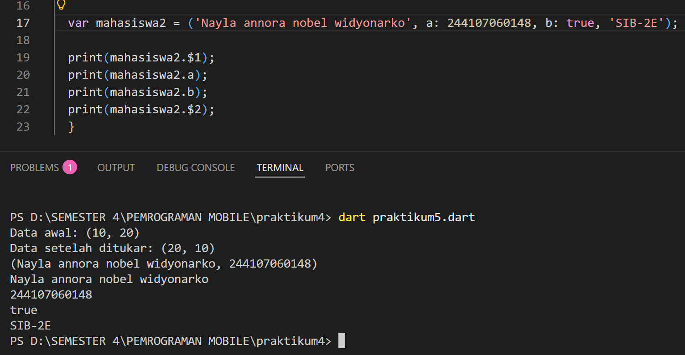

## TUGAS PRAKTIKUM

2. Jelaskan yang dimaksud Functions dalam bahasa Dart!

Function dalam bahasa Dart merupakan blok kode yang dapat digunakan untuk menjalankan tugas tertentu dan dapat ditpanggil kembali kapan saja dalam program, fungsi membantu program agar lebih terstruktur dan mudah dibaca.

3. Jelaskan jenis-jenis parameter di Functions beserta contoh sintaksnya!

a. Required parameter : parameter yang harus dipanggil 
```dart
void sapa(String nama) {
  print("Halo $nama");
}
void main() {
  sapa("Nayla");
}
```

b.  Optional positional parameter : parameter yang tidak wajib di isi dan ditulis dalam tanda kurung siku
```dart
void sapa(String nama, [String? pesan]) {
  print("Halo $nama");
  print(pesan);
}
void main() {
  sapa("Nayla");
}
```

c. Named parameter : parameter yang dipanggil menggunakan nama parameternya, ditulis dalam kurung kurawal
```dart
void dataMahasiswa({String? nama, int? umur}) {
  print("Nama: $nama");
  print("Umur: $umur");
}
void main() {
  dataMahasiswa(nama: "Nayla", umur: 19);
}
```

d. Required named parameter : named parameter yang wajib diisi menggunakan kata kunci required
```dart 
void dataMahasiswa({required String nama, required int umur}) {
  print("Nama: $nama");
  print("Umur: $umur");
}
void main() {
  dataMahasiswa(nama: "Nayla", umur: 19);
}
```

4. Jelaskan maksud Functions sebagai first-class objects beserta contoh sintaknya!

First-class objects yaitu fungsi dapat diperlakukan seperti data atau objek, sehingga dapat disimpan dalam variabel, dikirim sebagai parameter, dan dikembalikan dalam program
```dart
int tambah(int a, int b) {
  return a + b;
}
Function pilihOperasi() {
  return tambah; // fungsi dikembalikan
}
void jalankanOperasi(Function operasi) {
  print(operasi(5, 3)); // fungsi sebagai parameter
}
void main() {
  var fungsi = pilihOperasi(); // fungsi disimpan dalam variabel
  jalankanOperasi(fungsi);
}
```

5. Apa itu Anonymous Functions? Jelaskan dan berikan contohnya!

Anonymous functions merupakan fungsi yang tidak memiliki nama, fungsi ini biasa digunakan untuk operasi singkat dan sering dipakai sebagai parameter dalam fungsi lain
```dart
void main() {
  var tambah = (int a, int b) {
    return a + b;
  };
  print(tambah(3, 4));
}
```

6. Jelaskan perbedaan Lexical scope dan Lexical closures! Berikan contohnya!

a. lexical scope : aturan yang menentukan bahwa sebuah variabel dapat diakses berdasarkan penulisan kode dalam program
```dart
void main() {
  var nama = "Nayla";

  void sapa() {
    print("Halo $nama");
  }
  sapa();
}
```

b. lexical closure : dungsi yang menyimpan variabel dari scope tempat fungsi tersebut dibuat, bahkan ketika fungsi dipanggil di tempat lain
```dart
Function buatCounter() {
  int count = 0;
  return () {
    count++;
    print(count);
  };
}
void main() {
  var counter = buatCounter();
  counter();
  counter();
  counter();
}
```

7. Jelaskan dengan contoh cara membuat return multiple value di Functions!

a. contoh dengan return multiple value menggunakan record 
```dart
(String, int) getData() {
  return ("Nayla", 19);
}
void main() {
  var data = getData();
  print(data);
}
```

b. contoh dengan destructuting 
```dart
(String, int) getData() {
  return ("Nayla", 19);
}
void main() {
  var (nama, umur) = getData();
  print("Nama: $nama");
  print("Umur: $umur");
}
```

Untuk membuat return multiple value di Dart, kita bisa menggunakan Record sehingga satu fungsi dapat mengembalikan beberapa nilai sekaligus dalam satu struktur data