# Laporan Praktikum #05 - Aplikasi Pertama dan Widget Dasar Flutter

## Identitas Mahasiswa

| Atribut | Nilai                   |
| ------- | ----------------------- |
| Nama    | Nayla Annora Nobel W    |
| NIM     | 244107060148            |
| Kelas   | SIB-2E                  |

---
## Praktikum 1 : Membangun Layout di Flutter

### Langkah 1 :  Buat Project Baru

Buatlah sebuah project flutter baru dengan nama layout_flutter. Atau sesuaikan style laporan praktikum yang Anda buat.

### Langkah 2: Buka file lib/main.dart

Buka file main.dart lalu ganti dengan kode berikut. Isi nama dan NIM Anda di text title.
```dart
import 'package:flutter/material.dart';

void main() => runApp(const MyApp());

class MyApp extends StatelessWidget {
  const MyApp({super.key});

  @override
  Widget build(BuildContext context) {
    return MaterialApp(
      title: 'Flutter layout: Nama dan NIM Anda',
      home: Scaffold(
        appBar: AppBar(
          title: const Text('Flutter layout demo'),
        ),
        body: const Center(
          child: Text('Hello World'),
        ),
      ),
    );
  }
}
```

### Langkah 4: Implementasi title row
```dart
Widget titleSection = Container(
  padding: const EdgeInsets.all(...),
  child: Row(
    children: [
      Expanded(
        /* soal 1*/
        child: Column(
          crossAxisAlignment: ...,
          children: [
            /* soal 2*/
            Container(
              padding: const EdgeInsets.only(bottom: ...),
              child: const Text(
                'Wisata Gunung di Batu',
                style: TextStyle(
                  fontWeight: FontWeight.bold,
                ),
              ),
            ),
            Text(
              'Batu, Malang, Indonesia',
              style: TextStyle(...),
            ),
          ],
        ),
      ),
      /* soal 3*/
      Icon(
       ...,
        color: ...,
      ),
      const Text(...),
    ],
  ),
);
```

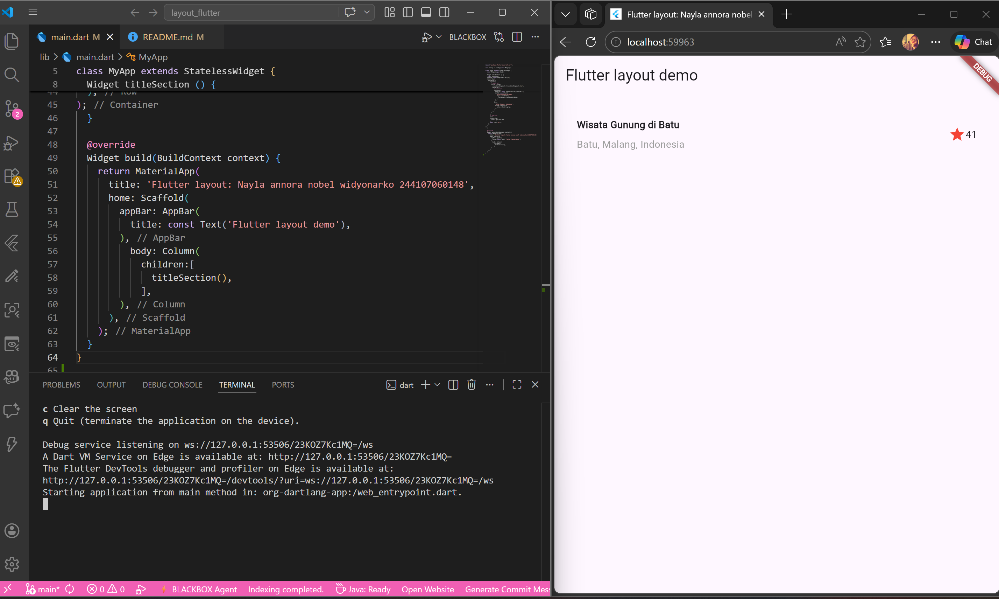
## Praktikum 2 : Implementasi button row

### Langkah 1 Buat method Column _buildButtonColumn
```dart
class MyApp extends StatelessWidget {
  const MyApp({super.key});

  @override
  Widget build(BuildContext context) {
    // ···
  }

  Column _buildButtonColumn(Color color, IconData icon, String label) {
    return Column(
      mainAxisSize: MainAxisSize.min,
      mainAxisAlignment: MainAxisAlignment.center,
      children: [
        Icon(icon, color: color),
        Container(
          margin: const EdgeInsets.only(top: 8),
          child: Text(
            label,
            style: TextStyle(
              fontSize: 12,
              fontWeight: FontWeight.w400,
              color: color,
            ),
          ),
        ),
      ],
    );
  }
}
```
### Langkah 2 : Buat widget buttonSection
```dart
Color color = Theme.of(context).primaryColor;

Widget buttonSection = Row(
  mainAxisAlignment: MainAxisAlignment.spaceEvenly,
  children: [
    _buildButtonColumn(color, Icons.call, 'CALL'),
    _buildButtonColumn(color, Icons.near_me, 'ROUTE'),
    _buildButtonColumn(color, Icons.share, 'SHARE'),
  ],
);
```
### Langkah 3 : Tambah button section ke body

Tambahkan variabel buttonSection ke dalam body seperti berikut:


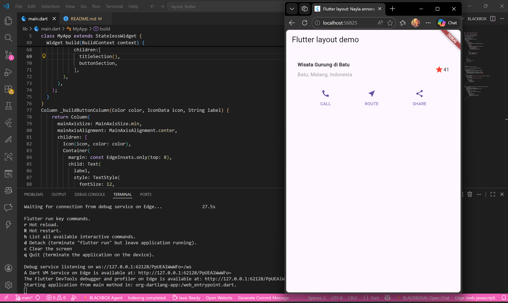

## Praktikum 3 : Implementasi text section

### Langkah 1 : Buat widget textSection

Masukkan teks ke dalam Container dan tambahkan padding di sepanjang setiap tepinya. Tambahkan kode berikut tepat di bawah deklarasi buttonSection:
```dart
Widget textSection = Container(
  padding: const EdgeInsets.all(32),
  child: const Text(
    'Ranu Kumbolo adalah danau kawah (maar) seluas 15 hektar yang terletak di ketinggian 2.400 mdpl di dalam Taman Nasional Bromo Tengger Semeru (TNBTS), Lumajang, Jawa Timur. Dikenal sebagai surga pendaki, danau ini menawarkan pemandangan matahari terbit yang ikonik, menjadi tempat camping favorit di jalur pendakian Gunung Semeru.'
    
    'author : Nayla Annora Nobel Widyonarko 244107060148',
    softWrap: true,
  ),
);
```

### Langkah 2: Tambahkan variabel text section ke body

Tambahkan widget variabel textSection ke dalam body seperti berikut:


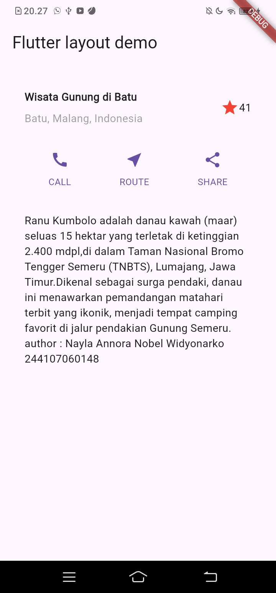

## Praktikum 4 : Implementasi image section

### Langkah 1 : Siapkan aset gambar

uatlah folder images di root project layout_flutter. Masukkan file gambar tersebut ke folder images, lalu set nama file tersebut ke file pubspec.yaml seperti berikut:

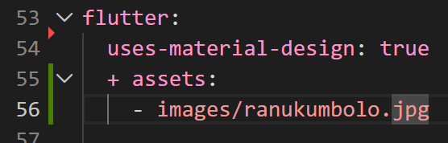

### Langkah 2 : Tambahkan gambar ke body

Tambahkan aset gambar ke dalam body seperti berikut:

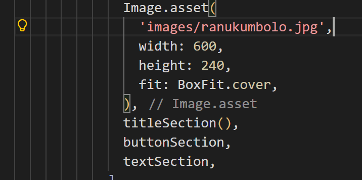

### Langkah 3: Terakhir, ubah menjadi ListView

Pada langkah terakhir ini, atur semua elemen dalam ListView, bukan Column, karena ListView mendukung scroll yang dinamis saat aplikasi dijalankan pada perangkat yang resolusinya lebih kecil.

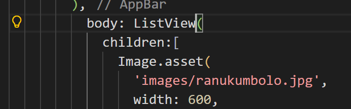

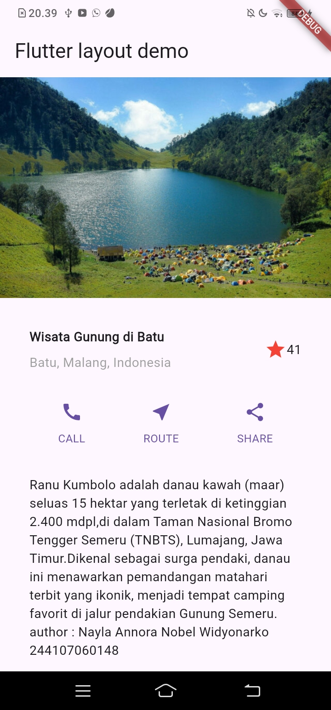

## Praktikum 5: Membangun Navigasi di Flutter

### Langkah 1: Siapkan project baru

Sebelum melanjutkan praktikum, buatlah sebuah project baru Flutter dengan nama belanja dan susunan folder seperti pada gambar berikut. Penyusunan ini dimaksudkan untuk mengorganisasi kode dan widget yang lebih mudah.

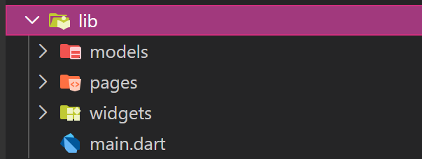

### Langkah 2: Mendefinisikan Route

Buatlah dua buah file dart dengan nama home_page.dart dan item_page.dart pada folder pages. Untuk masing-masing file, deklarasikan class HomePage pada file home_page.dart dan ItemPage pada item_page.dart. Turunkan class dari StatelessWidget. Gambaran potongan kode dapat anda lihat sebagai berikut.

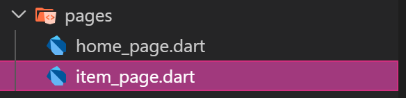
```dart
import 'package:flutter/material.dart';

class HomePage extends StatelessWidget {
  @override
  Widget build(BuildContext context) {
    throw UnimplementedError();
  }
}
```

### Langkah 3 : Lengkapi Kode di main.dart
```dart
void main() {
  runApp(MaterialApp(
    initialRoute: '/',
    routes: {
      '/': (context) => HomePage(),
      '/item': (context) => ItemPage(),
    },
  ));
}
```

### Langkah 4: Membuat data model

Untuk menangani hal ini, buatlah sebuah file dengan nama item.dart dan letakkan pada folder models. Pada file ini didefinisikan pemodelan data yang dibutuhkan. Ilustrasi kode yang dibutuhkan, dapat anda lihat pada potongan kode berikut.
```dart
class Item {
  String name;
  int price;

  Item({this.name, this.price});
}
```


### Langkah 5: Lengkapi kode di class HomePage

Pada halaman HomePage terdapat ListView widget. Sumber data ListView diambil dari model List dari object Item. Gambaran kode yang dibutuhkan untuk melakukan definisi model dapat anda lihat sebagai berikut.
```dart
class HomePage extends StatelessWidget {
  final list<Item> items = [
    Item(name: 'Sugar', price: 5000)
    Item(name: 'Salt', price: 2000)
  ];
}
```

### Langkah 6: Membuat ListView dan itemBuilder
```dart
margin: EdgeInsets.all(8),
      child: ListView.builder(
        padding: EdgeInsets.all(8),
        itemCount: items.length,
        itemBuilder: (context, index) {
          final item = items[index];
          return Card(
            child: Container(
              margin: EdgeInsets.all(8),
              child: Row(
                children: [
                  Expanded(child: Text(item.name)),
                  Expanded(
                    child: Text(
                      item.price.toString(),
                      textAlign: TextAlign.end,
                ),
              ),
            ],
          ),
        ),
      );
    },
  ),
```

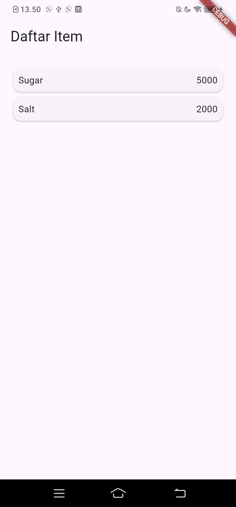

### Langkah 7: Menambahkan aksi pada ListView

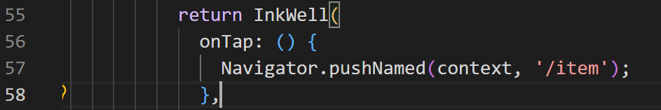


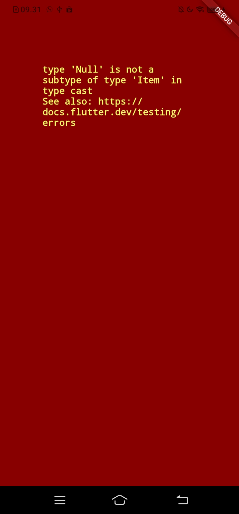

## Tugas Praktikum 2

### Langkah 1 

Untuk melakukan pengiriman data ke halaman berikutnya, cukup menambahkan informasi arguments pada penggunaan Navigator. Perbarui kode pada bagian Navigator menjadi seperti berikut.
```dart
Navigator.pushNamed(context, '/item', arguments: item);
```

### Langkah 2 

Pembacaan nilai yang dikirimkan pada halaman sebelumnya dapat dilakukan menggunakan ModalRoute. Tambahkan kode berikut pada blok fungsi build dalam halaman ItemPage.
```dart
final itemArgs = ModalRoute.of(context)!.settings.arguments as Item;
```

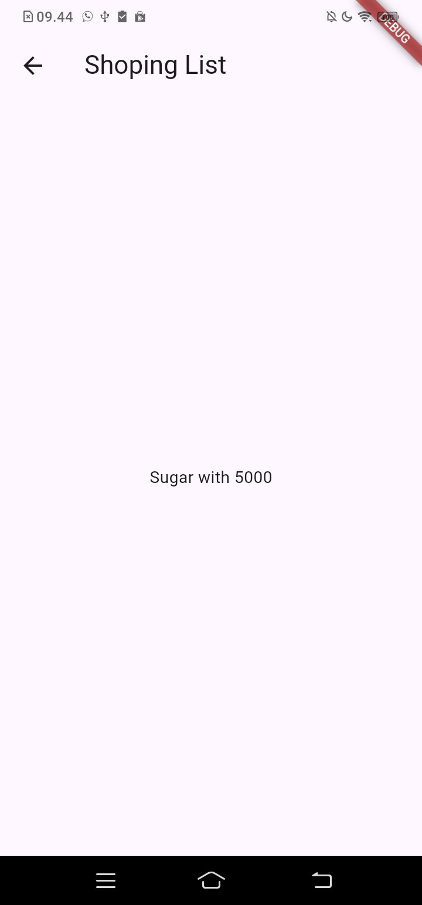

### Langkah 3

Ubahlah tampilan menjadi GridView seperti di aplikasi marketplace pada umumnya.

Menambahkan assets :

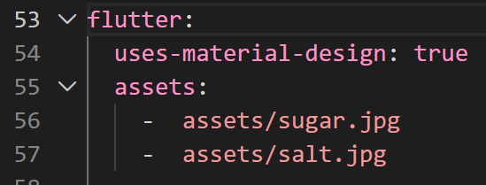

Menambahkan atribut :
```dart
class Item {
  String name;
  int price;
  String image;
  int stock;
  int rating;

  Item({
    required this.name, 
    required this.price, 
    required this.image, 
    required this.stock, 
    required this.rating
    });
}
```

Modifikasi pages/home_page.dart
```dart
import 'package:flutter/material.dart';
import 'package:belanja/models/item.dart';

class ItemPage extends StatelessWidget {
  const ItemPage({super.key});

  @override
  Widget build(BuildContext context) {
    final itemArgs = ModalRoute.of(context)!.settings.arguments as Item;

    return Scaffold(
      appBar: AppBar(
        title: const Text('Shopping List'),
      ),
      body: SingleChildScrollView( // Mencegah error overflow jika layar kecil
        child: Column(
          crossAxisAlignment: CrossAxisAlignment.start,
          children: [
            // Menampilkan Foto Produk
            Image.network(
              itemArgs.image,
              width: double.infinity,
              height: 300,
              fit: BoxFit.cover,
            ),
            Padding(
              padding: const EdgeInsets.all(16.0),
              child: Column(
                crossAxisAlignment: CrossAxisAlignment.start,
                children: [
                  // Nama Produk
                  Text(
                    itemArgs.name,
                    style: const TextStyle(fontSize: 24, fontWeight: FontWeight.bold),
                  ),
                  const SizedBox(height: 8),

                  // Harga Produk
                  Text(
                    'Rp ${itemArgs.price}',
                    style: const TextStyle(fontSize: 22, color: Colors.deepOrange, fontWeight: FontWeight.bold),
                  ),
                  const SizedBox(height: 16),

                  // Rating dan Stok
                  Row(
                    children: [
                      const Icon(Icons.star, color: Colors.amber, size: 24),
                      const SizedBox(width: 4),
                      Text(
                        itemArgs.rating.toString(),
                        style: const TextStyle(fontSize: 18),
                      ),
                      const SizedBox(width: 20),
                      Text(
                        'Stok Tersedia: ${itemArgs.stock}',
                        style: const TextStyle(fontSize: 16, color: Colors.grey),
                      ),
                    ],
                  ),
                ],
              ),
            ),
          ],
        ),
      ),
    );
  }
}
```

Modifikasi pages/item_page.dart
```dart
class ItemPage extends StatelessWidget {
  const ItemPage({super.key});

  @override
  Widget build(BuildContext context) {
    final itemArgs = ModalRoute.of(context)!.settings.arguments as Item;

    return Scaffold(
      appBar: AppBar(
        title: const Text('Shopping List'),
      ),
      body: SingleChildScrollView( // Mencegah error overflow jika layar kecil
        child: Column(
          crossAxisAlignment: CrossAxisAlignment.start,
          children: [
            // Menampilkan Foto Produk
            Image.network(
              itemArgs.image,
              width: double.infinity,
              height: 300,
              fit: BoxFit.cover,
            ),
            Padding(
              padding: const EdgeInsets.all(16.0),
              child: Column(
                crossAxisAlignment: CrossAxisAlignment.start,
                children: [
                  // Nama Produk
                  Text(
                    itemArgs.name,
                    style: const TextStyle(fontSize: 24, fontWeight: FontWeight.bold),
                  ),
                  const SizedBox(height: 8),

                  // Harga Produk
                  Text(
                    'Rp ${itemArgs.price}',
                    style: const TextStyle(fontSize: 22, color: Colors.deepOrange, fontWeight: FontWeight.bold),
                  ),
                  const SizedBox(height: 16),

                  // Rating dan Stok
                  Row(
                    children: [
                      const Icon(Icons.star, color: Colors.amber, size: 24),
                      const SizedBox(width: 4),
                      Text(
                        itemArgs.rating.toString(),
                        style: const TextStyle(fontSize: 18),
                      ),
                      const SizedBox(width: 20),
                      Text(
                        'Stok Tersedia: ${itemArgs.stock}',
                        style: const TextStyle(fontSize: 16, color: Colors.grey),
                      ),
                    ],
                  ),
                ],
              ),
            ),
          ],
        ),
      ),
    );
  }
}
```

### Langkah 4

Silakan implementasikan Hero widget pada aplikasi belanja Anda

Memodifikasi pages/home_page.dart
```dart
                      Expanded(
                        child: ClipRRect(
                          borderRadius: const BorderRadius.vertical(top: Radius.circular(10)),
                          child: Hero(
                            tag: itemArgs.name,
                            child: Image.network(
                              itemArgs.image,
                              width: double.infinity,
                              fit: BoxFit.cover,
                            ),
                          ),
                        )
                      )
```

Memodifikasi pages/item_page.dart

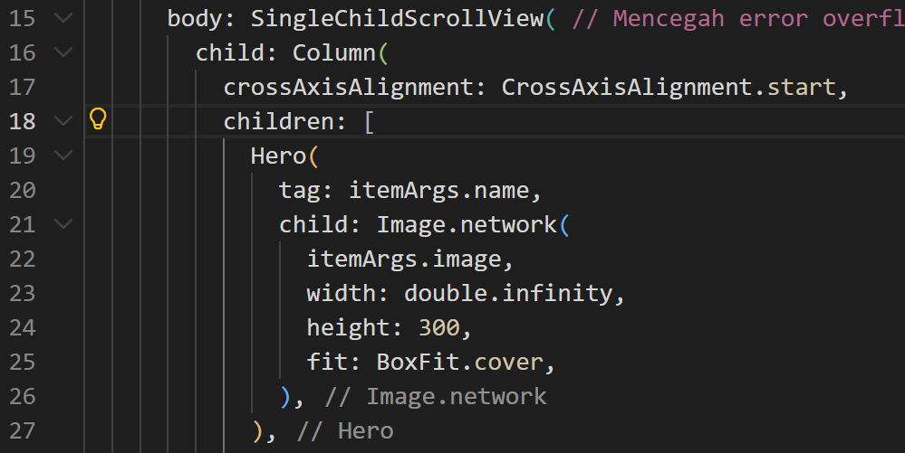


### Langkah 5

Sesuaikan dan modifikasi tampilan sehingga menjadi aplikasi yang menarik. Selain itu, pecah widget menjadi kode yang lebih kecil. Tambahkan Nama dan NIM di footer aplikasi belanja Anda.


