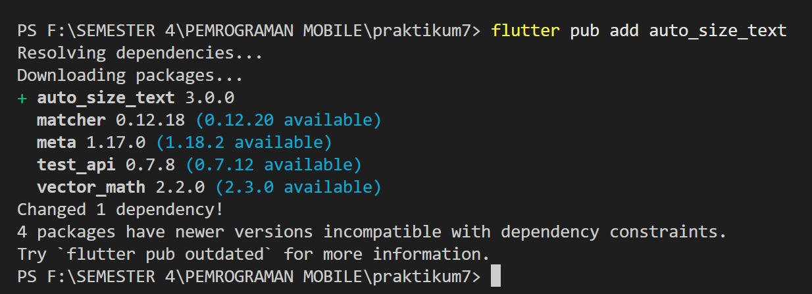

# Laporan Praktikum #05 - Aplikasi Pertama dan Widget Dasar Flutter

## Identitas Mahasiswa

| Atribut | Nilai                   |
| ------- | ----------------------- |
| Nama    | Nayla Annora Nobel W    |
| NIM     | 244107060148            |
| Kelas   | SIB-2E                  |

---
## Praktikum 7 : Praktikum Menerapkan Plugin di Project Flutter

### Langkah 2 : Menambahkan Plugin

Tambahkan plugin auto_size_text menggunakan perintah berikut di terminal



### Langkah 3 : Buat file red_text_widget.dart

Buat file baru bernama red_text_widget.dart di dalam folder lib lalu isi kode seperti berikut.
```dart
import 'package:flutter/material.dart';

class RedTextWidget extends StatelessWidget {
  const RedTextWidget({Key? key}) : super(key: key);

  @override
  Widget build(BuildContext context) {
    return Container();
  }
}
```

### Langkah 4: Tambah Widget AutoSizeText

Masih di file red_text_widget.dart, untuk menggunakan plugin auto_size_text, ubahlah kode return Container() menjadi seperti berikut.
```dart
return AutoSizeText(
      text,
      style: const TextStyle(color: Colors.red, fontSize: 14),
      maxLines: 2,
      overflow: TextOverflow.ellipsis,
);
```

Setelah Anda menambahkan kode di atas, Anda akan mendapatkan info error. Mengapa demikian? Jelaskan dalam laporan praktikum Anda!

Jawaban :
Karena AutoSizeText belum di-import dan Variabel text tidak didefinisikan

### Langkah 5: Buat Variabel text dan parameter di constructor

Tambahkan variabel text dan parameter di constructor seperti berikut.
```dart
final String text;
const RedTextWidget({Key? key, required this.text}) : super(key: key);
```

### Langkah 6: Tambahkan widget di main.dart

Buka file main.dart lalu tambahkan di dalam children: pada class _MyHomePageState
```dart
Container(
   color: Colors.yellowAccent,
   width: 50,
   child: const RedTextWidget(
             text: 'You have pushed the button this many times:',
          ),
),
Container(
    color: Colors.greenAccent,
    width: 100,
    child: const Text(
           'You have pushed the button this many times:',
          ),
),
```

Run aplikasi tersebut dengan tekan F5, maka hasilnya akan seperti berikut.
