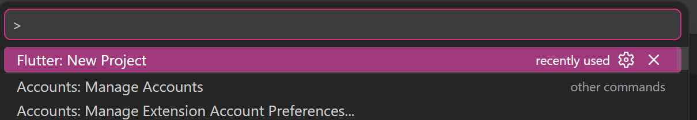
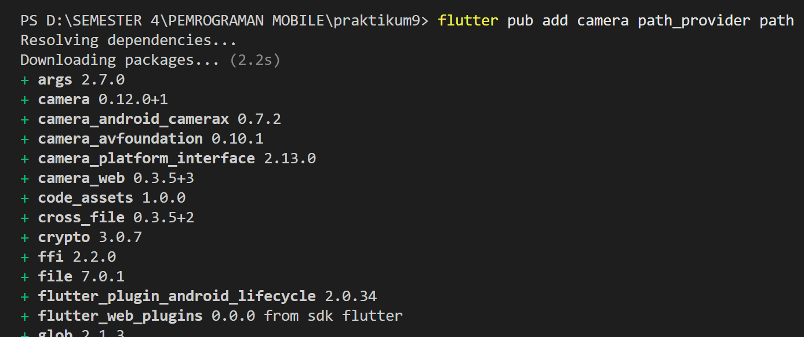

# Laporan Praktikum #05 - Aplikasi Pertama dan Widget Dasar Flutter

## Identitas Mahasiswa

| Atribut | Nilai                   |
| ------- | ----------------------- |
| Nama    | Nayla Annora Nobel W    |
| NIM     | 244107060148            |
| Kelas   | SIB-2E                  |

---

## Praktikum 1 : Mengambil Foto dengan Kamera di Flutter

### Langkah 1 : Buat Project Baru

Buatlah sebuah project flutter baru dengan nama kamera_flutter, lalu sesuaikan style laporan praktikum yang Anda buat.

### Langkah 2 : Langkah 2: Tambah dependensi yang diperlukan

Anda memerlukan tiga dependensi pada project flutter untuk menyelesaikan praktikum ini.

camera → menyediakan seperangkat alat untuk bekerja dengan kamera pada device.

path_provider → menyediakan lokasi atau path untuk menyimpan hasil foto.

path → membuat path untuk mendukung berbagai platform.

Untuk menambahkan dependensi plugin, jalankan perintah flutter pub add seperti berikut di terminal:

