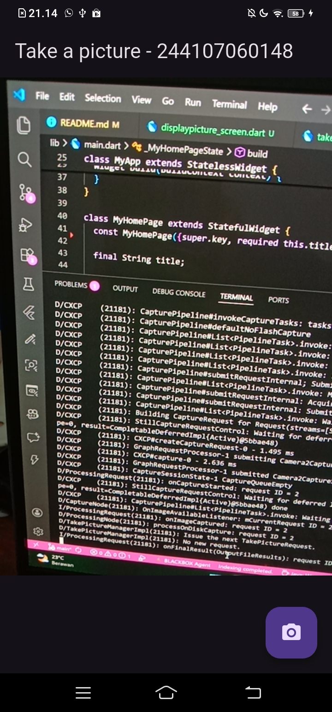
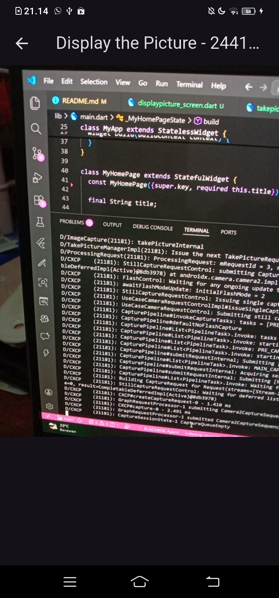

# Laporan Praktikum #05 - Aplikasi Pertama dan Widget Dasar Flutter

## Identitas Mahasiswa

| Atribut | Nilai                   |
| ------- | ----------------------- |
| Nama    | Nayla Annora Nobel W    |
| NIM     | 244107060148            |
| Kelas   | SIB-2E                  |

---

## Praktikum 1 : Mengambil Foto dengan Kamera di Flutter

### Langkah 1 : Buat Project Baru

Buatlah sebuah project flutter baru dengan nama kamera_flutter, lalu sesuaikan style laporan praktikum yang Anda buat.


### Langkah 2 : Tambah dependensi yang diperlukan

Anda memerlukan tiga dependensi pada project flutter untuk menyelesaikan praktikum ini.

camera → menyediakan seperangkat alat untuk bekerja dengan kamera pada device.

path_provider → menyediakan lokasi atau path untuk menyimpan hasil foto.

path → membuat path untuk mendukung berbagai platform.

Untuk menambahkan dependensi plugin, jalankan perintah flutter pub add seperti berikut di terminal:


### Langkah 3: Ambil Sensor Kamera dari device

Selanjutnya, kita perlu mengecek jumlah kamera yang tersedia pada perangkat menggunakan plugin camera seperti pada kode berikut ini. Kode ini letakkan dalam void main().
```dart
// Ensure that plugin services are initialized so that `availableCameras()`
// can be called before `runApp()`
WidgetsFlutterBinding.ensureInitialized();
// Obtain a list of the available cameras on the device.
final cameras = await availableCameras();
// Get a specific camera from the list of available cameras.
final firstCamera = cameras.first;
```

Ubah void main() menjadi async function seperti berikut ini.

```dart
Future<void> main() async {
  ...
}
```

Pastikan melakukan impor plugin sesuai yang dibutuhkan.

### Langkah 4: Buat dan inisialisasi CameraController

Setelah Anda dapat mengakses kamera, gunakan langkah-langkah berikut untuk membuat dan menginisialisasi CameraController. Pada langkah berikut ini, Anda akan membuat koneksi ke kamera perangkat yang memungkinkan Anda untuk mengontrol kamera dan menampilkan pratinjau umpan kamera.

1. Buat StatefulWidget dengan kelas State pendamping.
2. Tambahkan variabel ke kelas State untuk menyimpan CameraController.
3. Tambahkan variabel ke kelas State untuk menyimpan Future yang dikembalikan dari CameraController.initialize().
4. Buat dan inisialisasi controller dalam metode initState().
5. Hapus controller dalam metode dispose().

lib/widget/takepicture_screen.dart
```dart
class TakePictureScreen extends StatefulWidget {
  const TakePictureScreen({
    super.key,
    required this.camera,
  });

  final CameraDescription camera;

  @override
  TakePictureScreenState createState() => TakePictureScreenState();
}
class TakePictureScreenState extends State<TakePictureScreen> {
  late CameraController _controller;
  late Future<void> _initializeControllerFuture;

  @override
  void initState() {
    super.initState();
    _controller = CameraController(
      widget.camera,
      ResolutionPreset.medium,
    );
    _initializeControllerFuture = _controller.initialize();
  }
  @override
  void dispose() {
    _controller.dispose();
    super.dispose();
  }
  @override
  Widget build(BuildContext context) {
    return Container();
  }
}
```

### Langkah 5: Gunakan CameraPreview untuk menampilkan preview foto

Gunakan widget CameraPreview dari package camera untuk menampilkan preview foto. Anda perlu tipe objek void berupa FutureBuilder untuk menangani proses async.

lib/widget/takepicture_screen.dart
```dart
@override
  Widget build(BuildContext context) {
    return Scaffold(
      appBar: AppBar(title: const Text('Take a picture - NIM Anda')),
      // You must wait until the controller is initialized before displaying the
      // camera preview. Use a FutureBuilder to display a loading spinner until the
      // controller has finished initializing.
      body: FutureBuilder<void>(
        future: _initializeControllerFuture,
        builder: (context, snapshot) {
          if (snapshot.connectionState == ConnectionState.done) {
            // If the Future is complete, display the preview.
            return CameraPreview(_controller);
          } else {
            // Otherwise, display a loading indicator.
            return const Center(child: CircularProgressIndicator());
          }
        },
      ),
    ),
  }
```

### Langkah 6: Ambil foto dengan CameraController

Pada codelab ini, buatlah sebuah FloatingActionButton yang digunakan untuk mengambil gambar menggunakan CameraController saat pengguna mengetuk tombol.

Pengambilan gambar memerlukan 2 langkah:

1. Pastikan kamera telah diinisialisasi.
2. Gunakan controller untuk mengambil gambar dan pastikan ia mengembalikan objek Future.
Praktik baik untuk membungkus operasi kode ini dalam blok try / catch guna menangani berbagai kesalahan yang mungkin terjadi.

Kode berikut letakkan dalam Widget build setelah field body.

lib/widget/takepicture_screen.dart
```dart
FloatingActionButton(
  onPressed: () async {
    try {
      await _initializeControllerFuture;
      final image = await _controller.takePicture();
    } catch (e) {
      print(e);
    }
  },
  child: const Icon(Icons.camera_alt),
)
```

### Langkah 7: Buat widget baru DisplayPictureScreen

Buatlah file baru pada folder widget yang berisi kode berikut.

lib/widget/displaypicture_screen.dart
```dart
class DisplayPictureScreen extends StatelessWidget {
  final String imagePath;

  const DisplayPictureScreen({super.key, required this.imagePath});

  @override
  Widget build(BuildContext context) {
    return Scaffold(
      appBar: AppBar(title: const Text('Display the Picture - NIM Anda')),
      body: Image.file(File(imagePath)),
    );
  }
}
```

### Langkah 9: Menampilkan hasil foto

Tambahkan kode seperti berikut pada bagian try / catch agar dapat menampilkan hasil foto pada DisplayPictureScreen.

lib/widget/takepicture_screen.dart
```dart
      try {
            await _initializeControllerFuture;
            final image = await _controller.takePicture();
            if (!context.mounted) return;
            await Navigator.of(context).push(
              MaterialPageRoute(
                builder: (context) => DisplayPictureScreen(
                  imagePath: image.path,
                ),
              ),
            );
          } catch (e) {
            print(e);
          }
```

Silakan deploy pada device atau smartphone Anda dan perhatikan hasilnya! 






