# TUGAS - Aplikasi Flutter pertama Anda

## Identitas Mahasiswa

| Atribut | Nilai                   |
| ------- | ----------------------- |
| Nama    | Nayla Annora Nobel W    |
| NIM     | 244107060148            |
| Kelas   | SIB-2E                  |

---

## Membuat Project

### Membuat proyek Flutter pertama Anda

Buka file pubspec.yaml. Ganti konten file ini dengan kode berikut:
```dart
name: namer_app
description: A new Flutter project.

publish_to: 'none' # Remove this line if you wish to publish to pub.dev

version: 0.0.1+1

environment:
  sdk: '>=2.19.4 <4.0.0'

dependencies:
  flutter:
    sdk: flutter

  english_words: ^4.0.0
  provider: ^6.0.0

dev_dependencies:
  flutter_test:
    sdk: flutter

  flutter_lints: ^2.0.0

flutter:
  uses-material-design: true
```

Berikutnya, buka file konfigurasi lainnya dalam proyek tersebut, analysis_options.yaml. Ganti konten file tersebut dengan kode berikut:
```dart
include: package:flutter_lints/flutter.yaml

linter:
  rules:
    prefer_const_constructors: false
    prefer_final_fields: false
    use_key_in_widget_constructors: false
    prefer_const_literals_to_create_immutables: false
    prefer_const_constructors_in_immutables: false
    avoid_print: false
```

Terakhir, buka file main.dart pada direktori lib/. Ganti konten file ini dengan kode berikut:
```dart
import 'package:english_words/english_words.dart';
import 'package:flutter/material.dart';
import 'package:provider/provider.dart';

void main() {
  runApp(MyApp());
}

class MyApp extends StatelessWidget {
  const MyApp({super.key});

  @override
  Widget build(BuildContext context) {
    return ChangeNotifierProvider(
      create: (context) => MyAppState(),
      child: MaterialApp(
        title: 'Namer App',
        theme: ThemeData(
          useMaterial3: true,
          colorScheme: ColorScheme.fromSeed(seedColor: Colors.deepOrange),
        ),
        home: MyHomePage(),
      ),
    );
  }
}

class MyAppState extends ChangeNotifier {
  var current = WordPair.random();
}

class MyHomePage extends StatelessWidget {
  @override
  Widget build(BuildContext context) {
    var appState = context.watch<MyAppState>();

    return Scaffold(
      body: Column(
        children: [
          Text('A random idea:'),
          Text(appState.current.asLowerCase),
        ],
      ),
    );
  }
}
```

## Membuat Tombol

### Meluncurkan aplikasi


### Hot Reload Pertama

Di bagian bawah lib/main.dart, tambahkan sesuatu pada string di objek Text pertama.
```dart
// ...

    return Scaffold(
      body: Column(
        children: [
          Text('A random AWESOME idea:'),  // ← Example change.
          Text(appState.current.asLowerCase),
        ],
      ),
    );

// ...
```

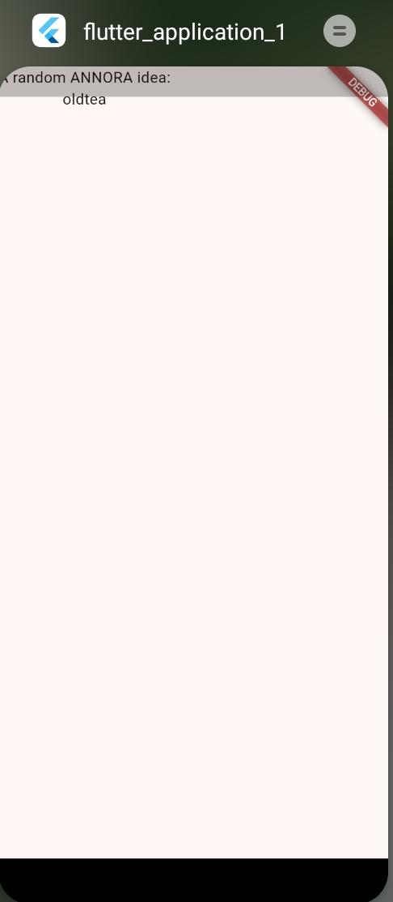

### Menambahkan tombol

Berikutnya, tambahkan tombol di bagian bawah Column, tepat di bawah instance Text kedua
```dart
// ...

    return Scaffold(
      body: Column(
        children: [
          Text('A random AWESOME idea:'),
          Text(appState.current.asLowerCase),

          // ↓ Add this.
          ElevatedButton(
            onPressed: () {
              print('button pressed!');
            },
            child: Text('Next'),
          ),

        ],
      ),
    );

// ...
```

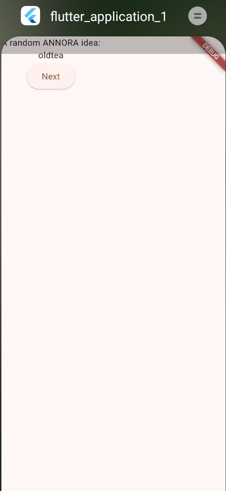

### Kursus singkat Flutter 5 menit

Perilaku pertama Anda

Scroll ke MyAppState lalu tambahkan metode getNext
```dart
// ...

class MyAppState extends ChangeNotifier {
  var current = WordPair.random();

  // ↓ Add this.
  void getNext() {
    current = WordPair.random();
    notifyListeners();
  }
}

// ...
```


## Memperindah tampilan aplikasi

### Mengekstrak widget

Tulis ulang widget MyHomePage sebagai berikut:
```dart
// ...

class MyHomePage extends StatelessWidget {
  @override
  Widget build(BuildContext context) {
    var appState = context.watch<MyAppState>();
    var pair = appState.current;                 // ← Add this.

    return Scaffold(
      body: Column(
        children: [
          Text('A random AWESOME idea:'),
          Text(pair.asLowerCase),                // ← Change to this.
          ElevatedButton(
            onPressed: () {
              appState.getNext();
            },
            child: Text('Next'),
          ),
        ],
      ),
    );
  }
}

// ...
```

### Menambahkan Kartu

Kode ini menggabungkan widget Padding, dan juga Text, dengan widget Card.

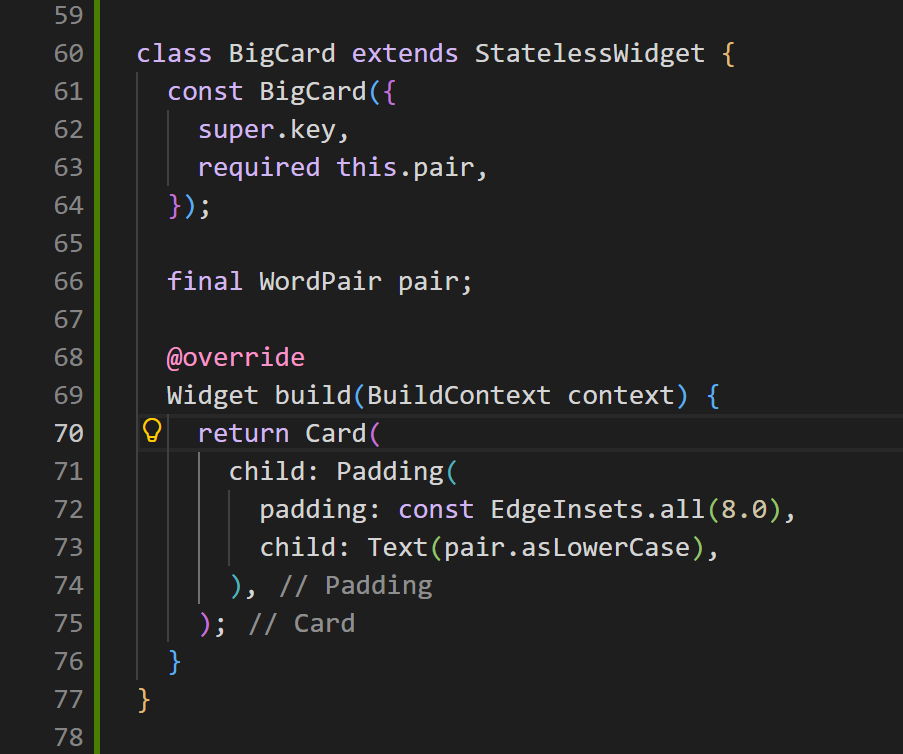

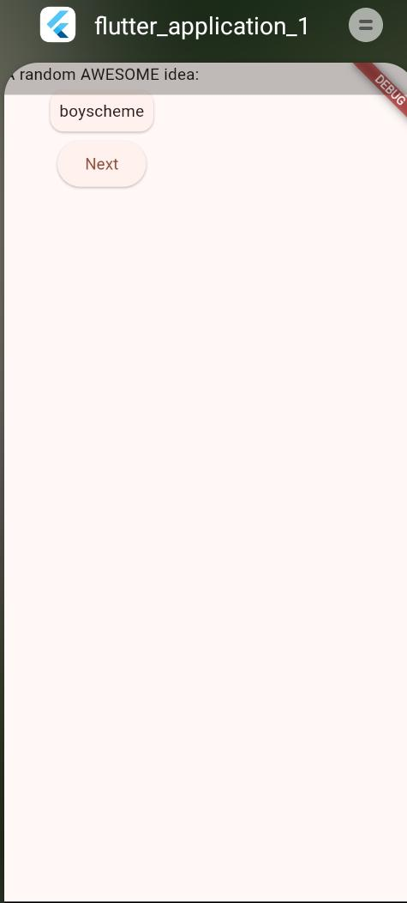

#### Tema dan gaya

Buat perubahan berikut untuk metode build() BigCard.
```dart
// ...

  @override
  Widget build(BuildContext context) {
    final theme = Theme.of(context);       // ← Add this.

    return Card(
      color: theme.colorScheme.primary,    // ← And also this.
      child: Padding(
        padding: const EdgeInsets.all(20),
        child: Text(pair.asLowerCase),
      ),
    );
  }

// ...
```

Kini, kartu telah diwarnai dengan warna primer aplikasi:

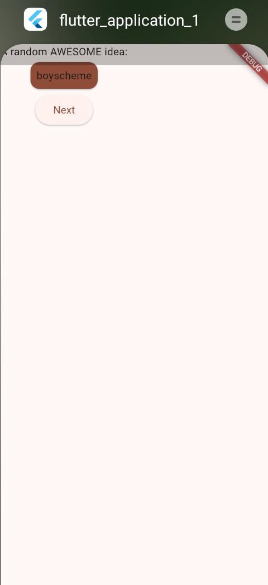

### TextTheme

Buat perubahan berikut pada metode build() BigCard.
```dart
// ...

  @override
  Widget build(BuildContext context) {
    final theme = Theme.of(context);
    // ↓ Add this.
    final style = theme.textTheme.displayMedium!.copyWith(
      color: theme.colorScheme.onPrimary,
    );

    return Card(
      color: theme.colorScheme.primary,
      child: Padding(
        padding: const EdgeInsets.all(20),
        // ↓ Change this line.
        child: Text(pair.asLowerCase, style: style),
      ),
    );
  }

// ...
```

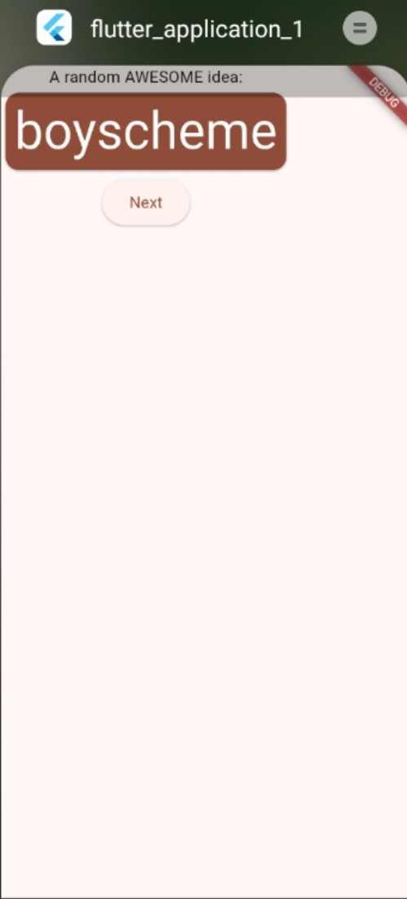

### Meningkatkan aksesibilitas
G
unakan properti semanticsLabel Text untuk mengganti konten visual widget teks dengan konten semantik yang lebih sesuai untuk pembaca layar:
```dart
// ...

  @override
  Widget build(BuildContext context) {
    final theme = Theme.of(context);
    final style = theme.textTheme.displayMedium!.copyWith(
      color: theme.colorScheme.onPrimary,
    );

    return Card(
      color: theme.colorScheme.primary,
      child: Padding(
        padding: const EdgeInsets.all(20),

        // ↓ Make the following change.
        child: Text(
          pair.asLowerCase,
          style: style,
          semanticsLabel: "${pair.first} ${pair.second}",
        ),
      ),
    );
  }

// ...
```

### Menempatkan UI di tengah

Buka metode build() MyHomePage, dan buat perubahan berikut:
```dart
// ...

class MyHomePage extends StatelessWidget {
  @override
  Widget build(BuildContext context) {
    var appState = context.watch<MyAppState>();
    var pair = appState.current;

    return Scaffold(
      body: Column(
        mainAxisAlignment: MainAxisAlignment.center,  // ← Add this.
        children: [
          Text('A random AWESOME idea:'),
          BigCard(pair: pair),
          ElevatedButton(
            onPressed: () {
              appState.getNext();
            },
            child: Text('Next'),
          ),
        ],
      ),
    );
  }
}

// ...
```

Tindakan ini menempatkan turunan dalam Column di tengah pada sumbu utamanya (vertikal).

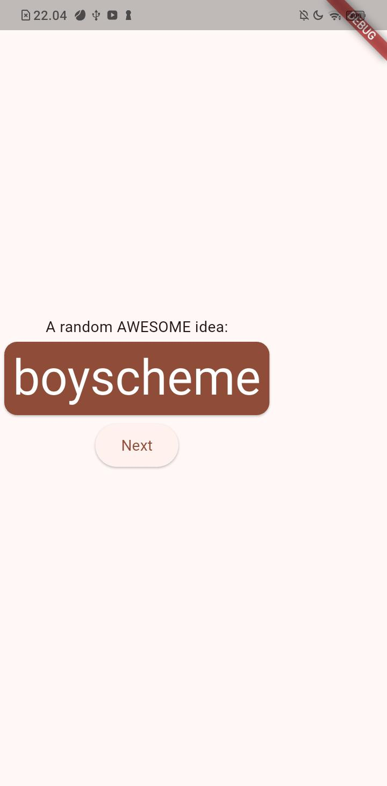

Tampilan center 

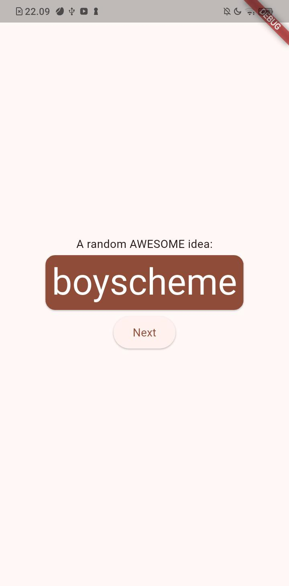

Dengan perubahan opsional, MyHomePage mencakup kode berikut:
```dart
// ...

class MyHomePage extends StatelessWidget {
  @override
  Widget build(BuildContext context) {
    var appState = context.watch<MyAppState>();
    var pair = appState.current;

    return Scaffold(
      body: Center(
        child: Column(
          mainAxisAlignment: MainAxisAlignment.center,
          children: [
            BigCard(pair: pair),
            SizedBox(height: 10),
            ElevatedButton(
              onPressed: () {
                appState.getNext();
              },
              child: Text('Next'),
            ),
          ],
        ),
      ),
    );
  }
}

// ...
```

Aplikasinya akan terlihat seperti berikut:


## Menambahkan Fungsi

### Menambahkan logika bisnis

Scroll ke MyAppState dan tambahkan kode berikut:
```dart
// ...

class MyAppState extends ChangeNotifier {
  var current = WordPair.random();

  void getNext() {
    current = WordPair.random();
    notifyListeners();
  }

  // ↓ Add the code below.
  var favorites = <WordPair>[];

  void toggleFavorite() {
    if (favorites.contains(current)) {
      favorites.remove(current);
    } else {
      favorites.add(current);
    }
    notifyListeners();
  }
}

// ...
```

## Menambahkan tombol

Buat perubahan berikut:
```dart
// ...

class MyHomePage extends StatelessWidget {
  @override
  Widget build(BuildContext context) {
    var appState = context.watch<MyAppState>();
    var pair = appState.current;

    return Scaffold(
      body: Center(
        child: Column(
          mainAxisAlignment: MainAxisAlignment.center,
          children: [
            BigCard(pair: pair),
            SizedBox(height: 10),
            Row(
              mainAxisSize: MainAxisSize.min,   // ← Add this.
              children: [
                ElevatedButton(
                  onPressed: () {
                    appState.getNext();
                  },
                  child: Text('Next'),
                ),
              ],
            ),
          ],
        ),
      ),
    );
  }
}

// ...
```

UI kembali ke tempat sebelumnya.

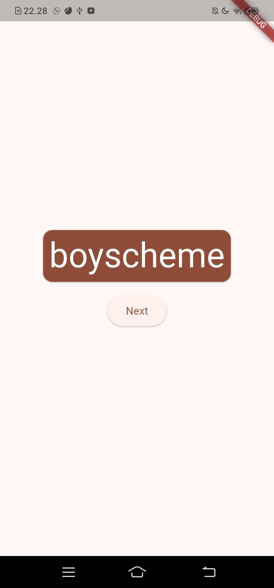

Berikutnya, tambahkan tombol Like dan hubungkan ke toggleFavorite(). Sebagai tantangan, coba lakukan sendiri untuk pertama kali, tanpa melihat blok kode di bawah.
```dart
// ...

class MyHomePage extends StatelessWidget {
  @override
  Widget build(BuildContext context) {
    var appState = context.watch<MyAppState>();
    var pair = appState.current;

    // ↓ Add this.
    IconData icon;
    if (appState.favorites.contains(pair)) {
      icon = Icons.favorite;
    } else {
      icon = Icons.favorite_border;
    }

    return Scaffold(
      body: Center(
        child: Column(
          mainAxisAlignment: MainAxisAlignment.center,
          children: [
            BigCard(pair: pair),
            SizedBox(height: 10),
            Row(
              mainAxisSize: MainAxisSize.min,
              children: [

                // ↓ And this.
                ElevatedButton.icon(
                  onPressed: () {
                    appState.toggleFavorite();
                  },
                  icon: Icon(icon),
                  label: Text('Like'),
                ),
                SizedBox(width: 10),

                ElevatedButton(
                  onPressed: () {
                    appState.getNext();
                  },
                  child: Text('Next'),
                ),
              ],
            ),
          ],
        ),
      ),
    );
  }
}

// ...
```

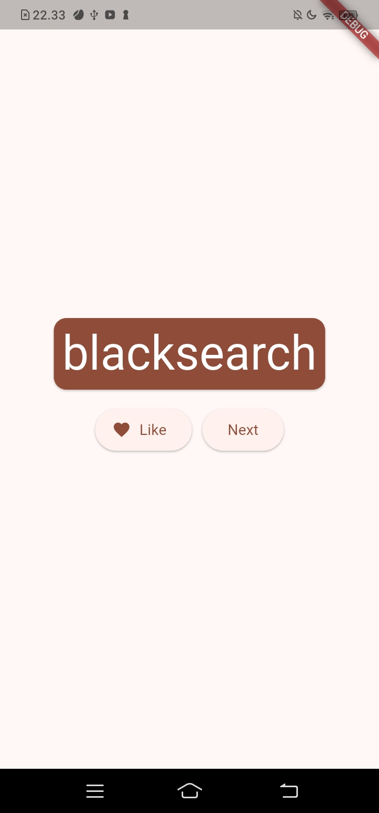

## Menambahkan kolom samping navigasi

```dart
// ...

class MyHomePage extends StatelessWidget {
  @override
  Widget build(BuildContext context) {
    return Scaffold(
      body: Row(
        children: [
          SafeArea(
            child: NavigationRail(
              extended: false,
              destinations: [
                NavigationRailDestination(
                  icon: Icon(Icons.home),
                  label: Text('Home'),
                ),
                NavigationRailDestination(
                  icon: Icon(Icons.favorite),
                  label: Text('Favorites'),
                ),
              ],
              selectedIndex: 0,
              onDestinationSelected: (value) {
                print('selected: $value');
              },
            ),
          ),
          Expanded(
            child: Container(
              color: Theme.of(context).colorScheme.primaryContainer,
              child: GeneratorPage(),
            ),
          ),
        ],
      ),
    );
  }
}

class GeneratorPage extends StatelessWidget {
  @override
  Widget build(BuildContext context) {
    var appState = context.watch<MyAppState>();
    var pair = appState.current;

    IconData icon;
    if (appState.favorites.contains(pair)) {
      icon = Icons.favorite;
    } else {
      icon = Icons.favorite_border;
    }

    return Center(
      child: Column(
        mainAxisAlignment: MainAxisAlignment.center,
        children: [
          BigCard(pair: pair),
          SizedBox(height: 10),
          Row(
            mainAxisSize: MainAxisSize.min,
            children: [
              ElevatedButton.icon(
                onPressed: () {
                  appState.toggleFavorite();
                },
                icon: Icon(icon),
                label: Text('Like'),
              ),
              SizedBox(width: 10),
              ElevatedButton(
                onPressed: () {
                  appState.getNext();
                },
                child: Text('Next'),
              ),
            ],
          ),
        ],
      ),
    );
  }
}

// ...
```

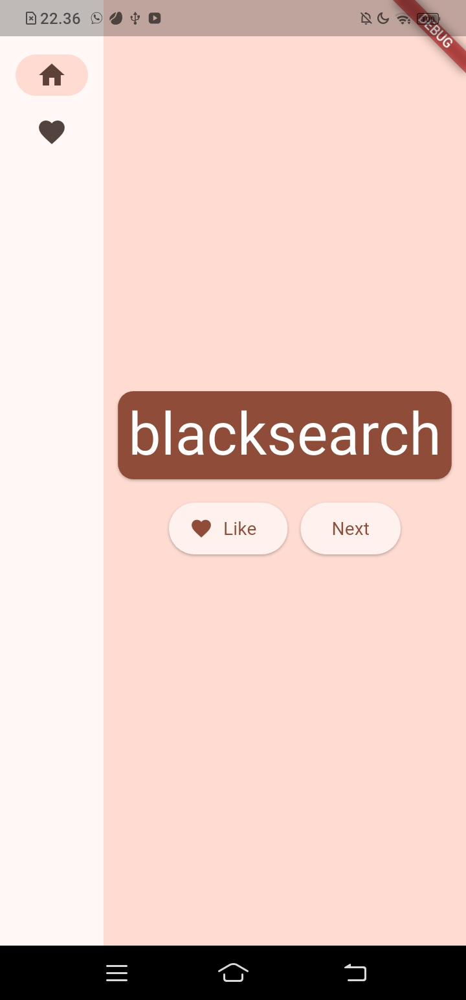

### setState
```dart
// ...

class _MyHomePageState extends State<MyHomePage> {

  var selectedIndex = 0;     // ← Add this property.

  @override
  Widget build(BuildContext context) {
    return Scaffold(
      body: Row(
        children: [
          SafeArea(
            child: NavigationRail(
              extended: false,
              destinations: [
                NavigationRailDestination(
                  icon: Icon(Icons.home),
                  label: Text('Home'),
                ),
                NavigationRailDestination(
                  icon: Icon(Icons.favorite),
                  label: Text('Favorites'),
                ),
              ],
              selectedIndex: selectedIndex,    // ← Change to this.
              onDestinationSelected: (value) {

                // ↓ Replace print with this.
                setState(() {
                  selectedIndex = value;
                });

              },
            ),
          ),
          Expanded(
            child: Container(
              color: Theme.of(context).colorScheme.primaryContainer,
              child: GeneratorPage(),
            ),
          ),
        ],
      ),
    );
  }
}

// ...
```

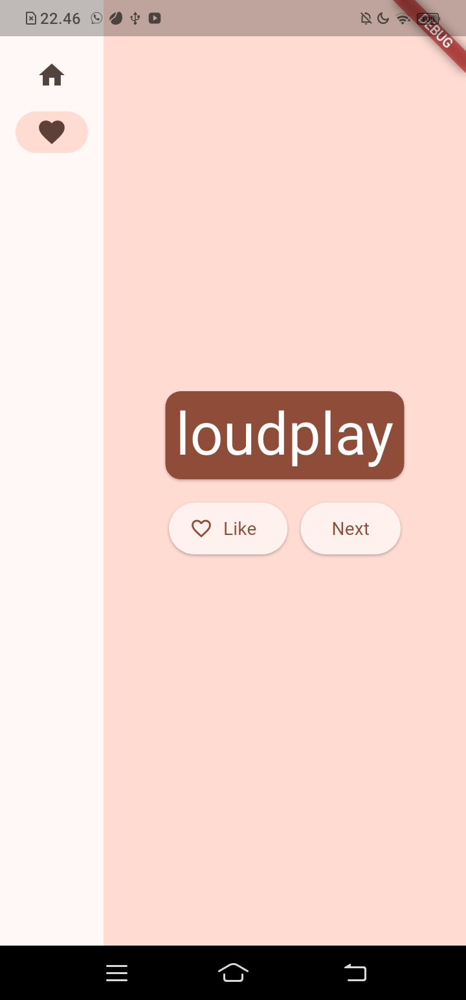

### Menggunakan selectedIndex
```dart
// ...

Widget page;
switch (selectedIndex) {
  case 0:
    page = GeneratorPage();
    break;
  case 1:
    page = Placeholder();
    break;
  default:
    throw UnimplementedError('no widget for $selectedIndex');
}

// ...
```

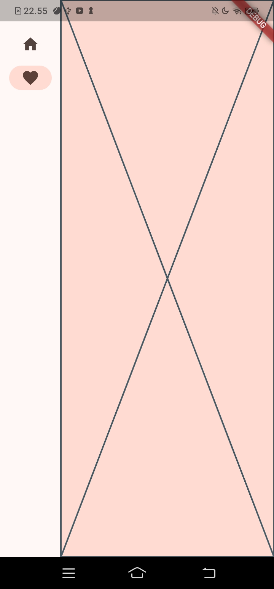

### Tingkat respons

 Buat perubahan baris tunggal berikut untuk metode build _MyHomePageState:
 ```dart
 // ...

class _MyHomePageState extends State<MyHomePage> {
  var selectedIndex = 0;

  @override
  Widget build(BuildContext context) {
    Widget page;
    switch (selectedIndex) {
      case 0:
        page = GeneratorPage();
        break;
      case 1:
        page = Placeholder();
        break;
      default:
        throw UnimplementedError('no widget for $selectedIndex');
    }

    return LayoutBuilder(builder: (context, constraints) {
      return Scaffold(
        body: Row(
          children: [
            SafeArea(
              child: NavigationRail(
                extended: constraints.maxWidth >= 600,  // ← Here.
                destinations: [
                  NavigationRailDestination(
                    icon: Icon(Icons.home),
                    label: Text('Home'),
                  ),
                  NavigationRailDestination(
                    icon: Icon(Icons.favorite),
                    label: Text('Favorites'),
                  ),
                ],
                selectedIndex: selectedIndex,
                onDestinationSelected: (value) {
                  setState(() {
                    selectedIndex = value;
                  });
                },
              ),
            ),
            Expanded(
              child: Container(
                color: Theme.of(context).colorScheme.primaryContainer,
                child: page,
              ),
            ),
          ],
        ),
      );
    });
  }
}

// ...
```

## Menambahkan Halaman baru

Berikut class FavoritesPage baru:
```dart
// ...

class FavoritesPage extends StatelessWidget {
  @override
  Widget build(BuildContext context) {
    var appState = context.watch<MyAppState>();

    if (appState.favorites.isEmpty) {
      return Center(
        child: Text('No favorites yet.'),
      );
    }

    return ListView(
      children: [
        Padding(
          padding: const EdgeInsets.all(20),
          child: Text('You have '
              '${appState.favorites.length} favorites:'),
        ),
        for (var pair in appState.favorites)
          ListTile(
            leading: Icon(Icons.favorite),
            title: Text(pair.asLowerCase),
          ),
      ],
    );
  }
}
```


